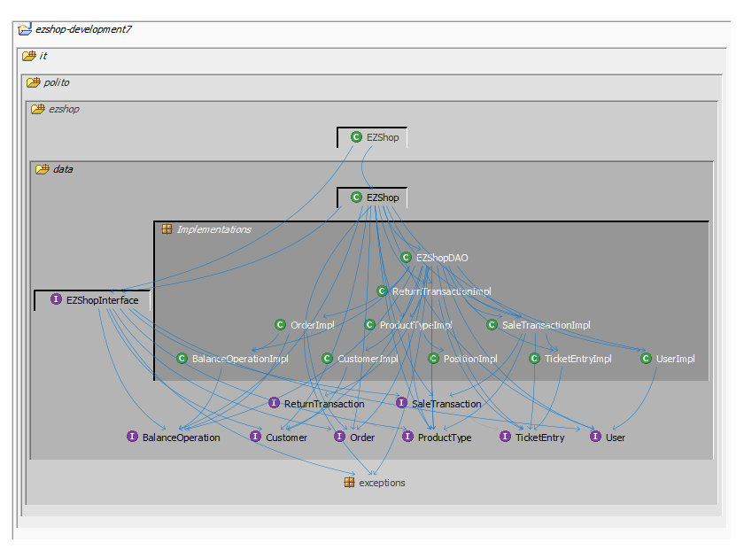
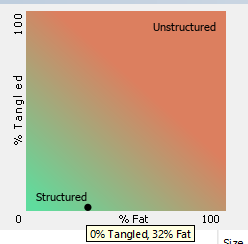
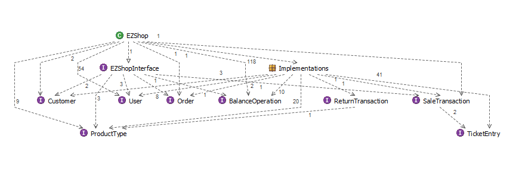

# Design assessment


```
<The goal of this document is to analyse the structure of your project, compare it with the design delivered
on April 30, discuss whether the design could be improved>
```

# Levelized structure map
```
<Applying Structure 101 to your project, version to be delivered on june 4, produce the Levelized structure map,
with all elements explosed, all dependencies, NO tangles; and report it here as a picture>
```


# Structural over complexity chart
```
<Applying Structure 101 to your project, version to be delivered on june 4, produce the structural over complexity chart; and report it here as a picture>
```



# Size metrics

```
<Report here the metrics about the size of your project, collected using Structure 101>
```


| Metric                                    | Measure |
| ----------------------------------------- | ------- |
| Packages                                  |  6       |
| Classes (outer)                           |   40      |
| Classes (all)                             |  40       |
| NI (number of bytecode instructions)      |  9224       |
| LOC (non comment non blank lines of code) |  3975       |


# Items with XS

```
<Report here information about code tangles and fat packages>
```

| Item | Tangled | Fat  | Size | XS   |
| ---- | ------- | ---- | ---- | ---- |
|it.polito.ezshop.data      |  42.16%       | 2     | 9038     | 3810     |


# Package level tangles

```
<Report screen captures of the package-level tangles by opening the items in the "composition perspective" 
(double click on the tangle from the Views->Complexity page)>
```



# Summary analysis
```
<Discuss here main differences of the current structure of your project vs the design delivered on April 30>
<Discuss if the current structure shows weaknesses that should be fixed>
```
The principal difference between the first design document delivered on April 30 and the real design that we applied while coding consists in the DAO classes: in the first design, we decided to implement a DAO class for each other class that we decided to have in the model package; instead, due to structural complications with this design, we decided to implement only one DAO class, EZShopDAO.  
Other changes were related to the elimination of some classes in the model package, since they were no more necessary with the coding that we did; the classes eliminated have been: LoyaltyCard, Credit, Debit, AccountBook.
  

The current structure presents one tangle, that, in our opinion, has not to be considered as a real tangle: in fact, we decided to put all the classes that implement an interface in a different sub-package of it.polito.ezshop.data, together with the DAO class. They all are in the package it.polito.ezshop.data.Implementations, and this causes a design tangle, the one that has been reported in the table below.   
This is a decision that we took in order to make more readable the package structure, it can be resolved by simply put all the classes that are in it.polito.ezshop.data.Implementations inside the upper package, it.polito.ezshop.data.    
