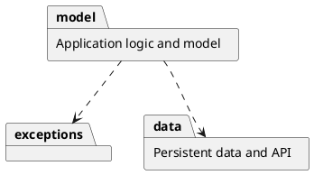
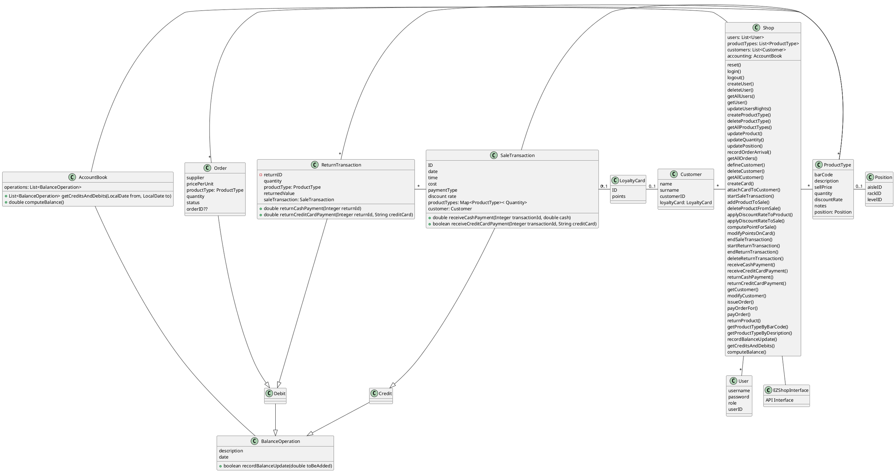
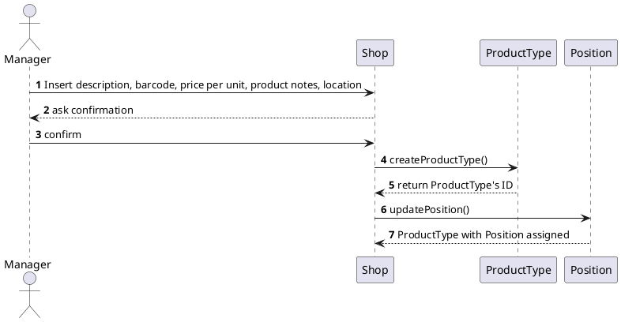
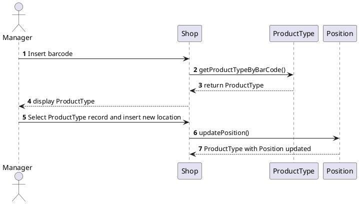
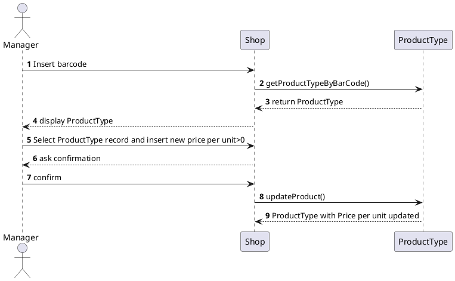
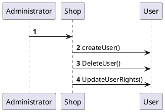
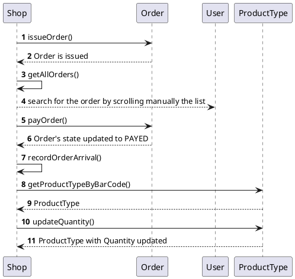
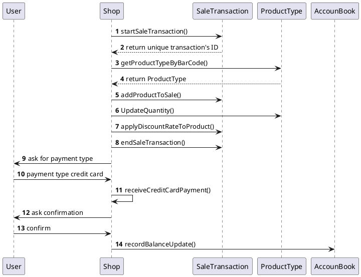
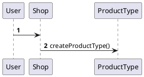
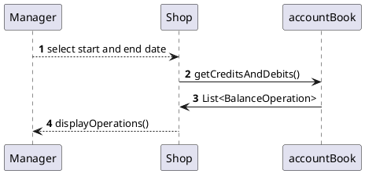

# Design Document 

Authors: Elia Fontana, Andrea Palomba, Leonardo Perugini, Francesco Sattolo

Date: 27/04/2021

Version: 1.0

# Contents

- [Design Document](#design-document)
- [Contents](#contents)
- [Instructions](#instructions)
- [High level design](#high-level-design)
- [Low level design](#low-level-design)
- [Verification traceability matrix](#verification-traceability-matrix)
- [Verification sequence diagrams](#verification-sequence-diagrams)
- [UC1 - Manage products](#uc1---manage-products)
    - [Scenario 1.1 - Create product type X](#scenario-11---create-product-type-x)
    - [Scenario 1.2 - Modify product type location](#scenario-12---modify-product-type-location)
    - [Scenario 1.3 - Modify product type price per unit](#scenario-13---modify-product-type-price-per-unit)
- [FR1](#fr1)
    - [UC3](#uc3)
    - [Scenario 6.2](#scenario-62)
- [FR3](#fr3)
- [FR7](#fr7)
- [UC9 - Accounting](#uc9---accounting)
  - [Scenario 9-1](#scenario-9-1)

# Instructions

The design must satisfy the Official Requirements document, notably functional and non functional requirements

# High level design 

<discuss architectural styles used, if any>
Architectures:
- Model View Controller
- Stand alone Application
- 3 tier layered

<report package diagram>

# Low level design

<for each package, report class diagram>

class Quantity {
    quantity
}
(SaleTransaction, ProductType)  .. Quantity
???

# Verification traceability matrix

\<for each functional requirement from the requirement document, list which classes concur to implement it>

# Verification sequence diagrams 
\<select key scenarios from the requirement document. For each of them define a sequence diagram showing that the scenario can be implemented by the classes and methods in the design>

# UC1 - Manage products
### Scenario 1.1 - Create product type X

### Scenario 1.2 - Modify product type location

### Scenario 1.3 - Modify product type price per unit

# FR1

### UC3

### Scenario 6.2

# FR3 

# FR7 

# UC9 - Accounting 
## Scenario 9-1

