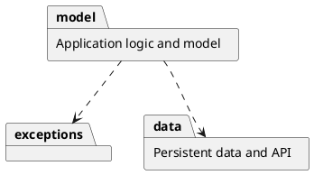
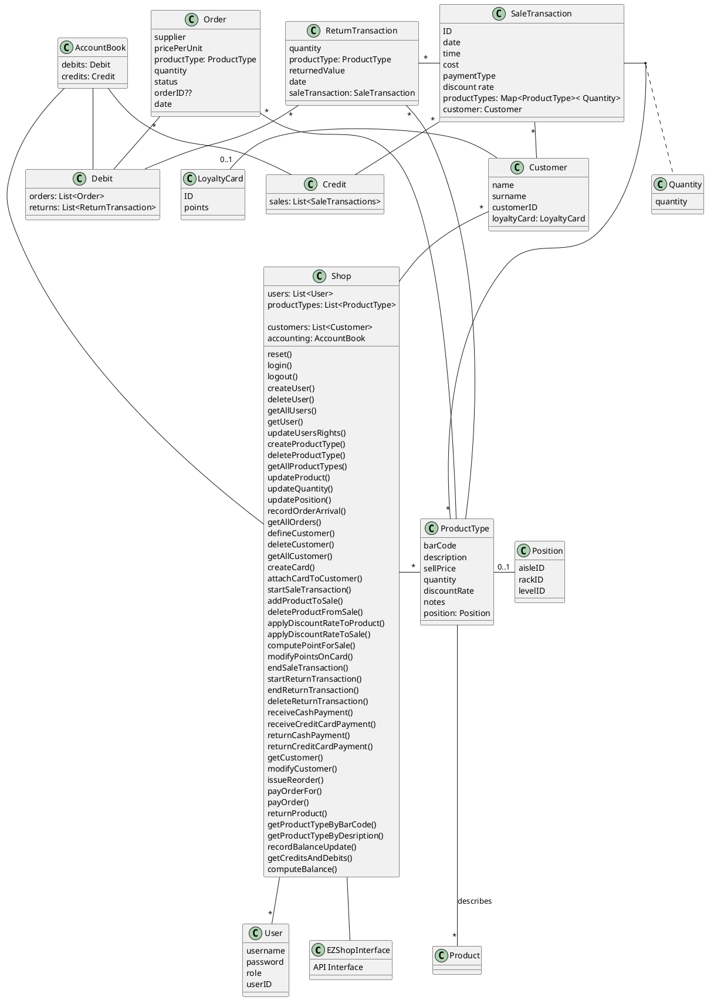
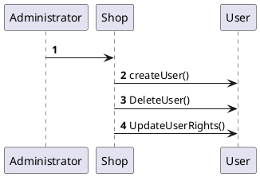
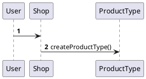

# Design Document 

Authors: Elia Fontana, Andrea Palomba, Leonardo Perugini, Francesco Sattolo

Date: 27/04/2021

Version: 1.0

# Contents

- [Design Document](#design-document)
- [Contents](#contents)
- [Instructions](#instructions)
- [High level design](#high-level-design)
- [Low level design](#low-level-design)
- [Verification traceability matrix](#verification-traceability-matrix)
- [Verification sequence diagrams](#verification-sequence-diagrams)
- [FR1](#fr1)
- [FR3](#fr3)
- [notes](#notes)

# Instructions

The design must satisfy the Official Requirements document, notably functional and non functional requirements

# High level design 

<discuss architectural styles used, if any>
Architectures:
- Model View Controller
- Stand alone Application
- 3 tier layered

<report package diagram>

# Low level design

<for each package, report class diagram>

# Verification traceability matrix

\<for each functional requirement from the requirement document, list which classes concur to implement it>

# Verification sequence diagrams 
\<select key scenarios from the requirement document. For each of them define a sequence diagram showing that the scenario can be implemented by the classes and methods in the design>

# FR1

# FR3 

# notes
- servono 3 package: data, model, exceptions
- ci daranno la classe Customer, User, ProductType e le Exceptions perche' ci sono nell'API (non serve metterle nel nostro class diagram perche' tanto non sappiamo come sono fatte)
- volendo si possono aggiungere altre exception al package Exception
- sequence diagrams nomi funzioni
- Sequence diagrams anche solo per gli scenari piu' importanti, l'importante e' avere tutte le classi che servono
- differenza tra ticket e saleTransaction e' che si puo' fare rollback della transazione ma non del ticket, decidiamo noi se avere una classe apposta per il ticket o meno
- scrivere tipo di collezioni usate
- nota vicino alle classi persistenti, non e' necessario mostrare le interazioni con lo storage
- Shop implements API interface
- No implementazione delle relationship, solo frecce e indicare collection usata 
- Nel sequence diagram basta function name senza parametri\
- Issue: ID of customer integer o string?
- Per gestire file di credit card per ora basta una classe credit card
- estimation approach non scrivere niente
