# Design Document 

Authors: Elia Fontana, Andrea Palomba, Leonardo Perugini, Francesco Sattolo

Date: 27/04/2021

Version: 1.0

# Contents

- [Design Document](#design-document)
- [Contents](#contents)
- [Instructions](#instructions)
- [High level design](#high-level-design)
- [Low level design](#low-level-design)
- [Verification traceability matrix](#verification-traceability-matrix)
- [Verification sequence diagrams](#verification-sequence-diagrams)
- [UC1 - Manage products](#uc1---manage-products)
    - [Scenario 1.1 - Create product type X](#scenario-11---create-product-type-x)
    - [Scenario 1.2 - Modify product type location](#scenario-12---modify-product-type-location)
    - [Scenario 1.3 - Modify product type price per unit](#scenario-13---modify-product-type-price-per-unit)
- [UC2 - Manage users and rights](#uc2---manage-users-and-rights)
    - [Scenario 2.1 Create user and define rights](#scenario-21-create-user-and-define-rights)
    - [Scenario 2.2 Delete user](#scenario-22-delete-user)
- [UC3 - Manage inventory and orders](#uc3---manage-inventory-and-orders)
    - [Scenario 3.1 - Order of product type X issued](#scenario-31---order-of-product-type-x-issued)
    - [Scenario 3.2 - Order of product type X payed](#scenario-32---order-of-product-type-x-payed)
    - [Scenario 3.3 - Record order of product type X arrival](#scenario-33---record-order-of-product-type-x-arrival)
- [UC4 - Manage Customers and  Cards](#uc4---manage-customers-and--cards)
    - [Scenario 4.1 - Create customer record](#scenario-41---create-customer-record)
    - [Scenario 4.2 - Attach Loyalty card to customer record](#scenario-42---attach-loyalty-card-to-customer-record)
    - [Scenario 4.4 - Update customer record](#scenario-44---update-customer-record)
- [UC6 - Manage sale transaction](#uc6---manage-sale-transaction)
    - [Scenario 6.2 - Sale of product type X with product discount (credit card)](#scenario-62---sale-of-product-type-x-with-product-discount-credit-card)
    - [Scenario 6.4 - Sale of product type X with Loyalty Card update (cash)](#scenario-64---sale-of-product-type-x-with-loyalty-card-update-cash)
- [UC8 - Manage return transaction](#uc8---manage-return-transaction)
    - [Scenario 8.1/8.2 - Return transaction of product type X completed (credit card/cash)](#scenario-8182---return-transaction-of-product-type-x-completed-credit-cardcash)
- [UC9 - Accounting](#uc9---accounting)
  - [Scenario 9.1 - List credits and debits](#scenario-91---list-credits-and-debits)

# Instructions

The design must satisfy the Official Requirements document, notably functional and non functional requirements

# High level design 

<discuss architectural styles used, if any>
Architectures:
- Model View Controller
- Stand alone Application
- 3 tier layered

<report package diagram>

# Low level design

<for each package, report class diagram>

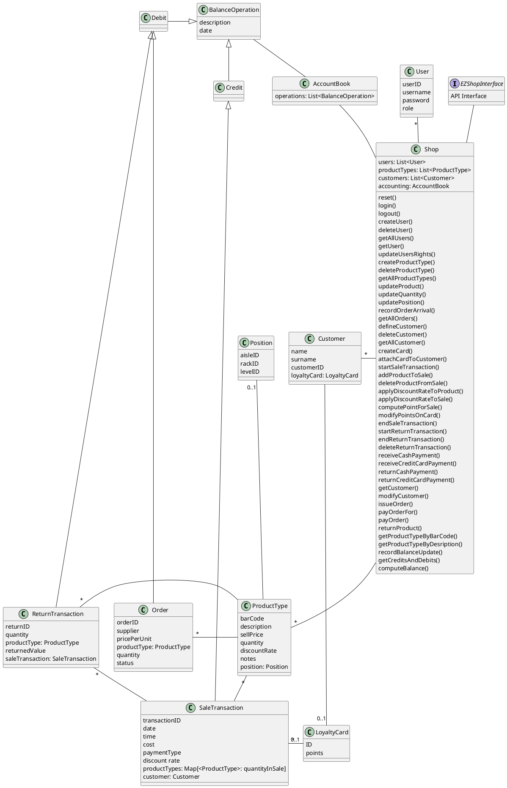

# Verification traceability matrix

\<for each functional requirement from the requirement document, list which classes concur to implement it>
|     | Shop | User | ProductType | Customer | AccountBook | LoyaltyCard | SaleTransaction | Position | Quantity | ReturnTransaction | Order | Debit | Credit | BalanceOperation |
| --- | ---- | ---- | ----------- | -------- | ----------- | ----------- | --------------- | -------- | -------- | ----------------- | ----- | ----- | ------ | ---------------- |
| FR1 | X    | X    |             |          |             |             |                 |          |          |                   |       |       |        |                  |
| FR3 | X    |      | X           |          |             |             |                 | X        |          |                   |       |       |        |                  |
| FR4 | X    |      | X           |          |             |             |                 | X        |          |                   | X     |       |        |                  |
| FR5 | X    |      |             | X        |             | X           |                 |          |          |                   |       |       |        |                  |
| FR6 | X    |      | X           |          | X           |             | X               |          |          | X                 |       |       |        |                  |
| FR7 | X    |      |             |          |             |             | X               |          |          | X                 |       |       |        |                  |
| FR8 | X    |      |             |          | X           |             |                 |          |          |                   |       | X     | X      | X                |

# Verification sequence diagrams 
\<select key scenarios from the requirement document. For each of them define a sequence diagram showing that the scenario can be implemented by the classes and methods in the design>

# UC1 - Manage products
### Scenario 1.1 - Create product type X

### Scenario 1.2 - Modify product type location

### Scenario 1.3 - Modify product type price per unit

# UC2 - Manage users and rights
### Scenario 2.1 Create user and define rights

### Scenario 2.2 Delete user

# UC3 - Manage inventory and orders

### Scenario 3.1 - Order of product type X issued

### Scenario 3.2 - Order of product type X payed

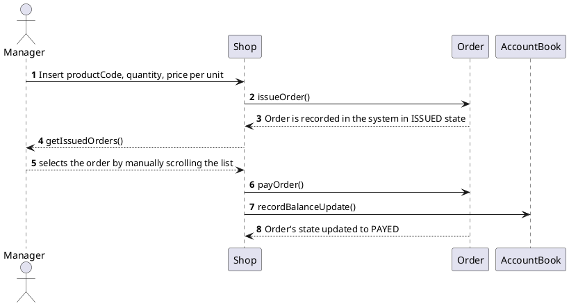

### Scenario 3.3 - Record order of product type X arrival

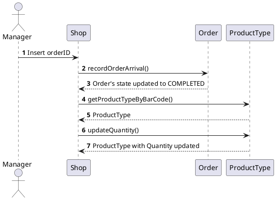
# UC4 - Manage Customers and  Cards
### Scenario 4.1 - Create customer record

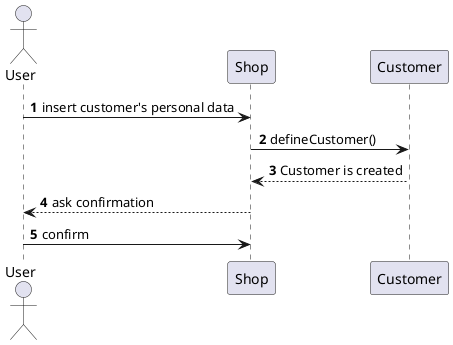
### Scenario 4.2 - Attach Loyalty card to customer record

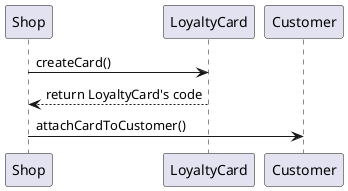

### Scenario 4.4 - Update customer record

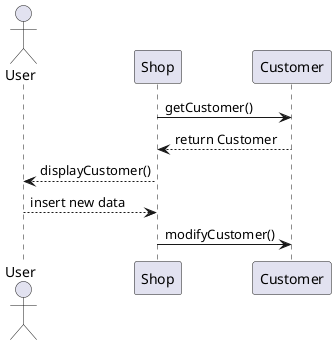

# UC5 - Authenticate, authorize
### Scenario 5.1/5.2 - Login/Logout

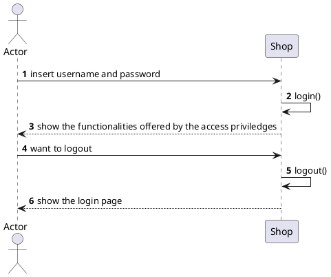

# UC6 - Manage sale transaction
### Scenario 6.2 - Sale of product type X with product discount (credit card)

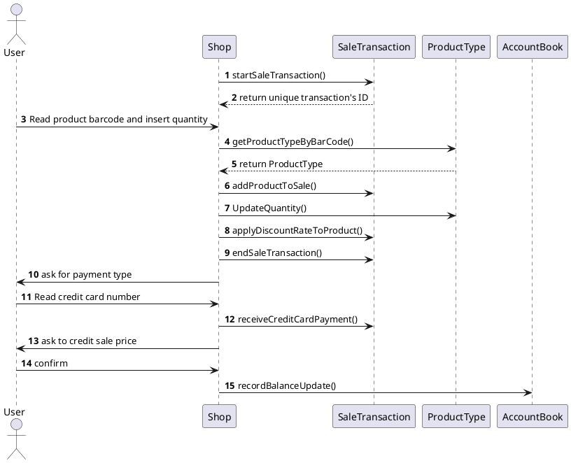

### Scenario 6.4 - Sale of product type X with Loyalty Card update (cash)

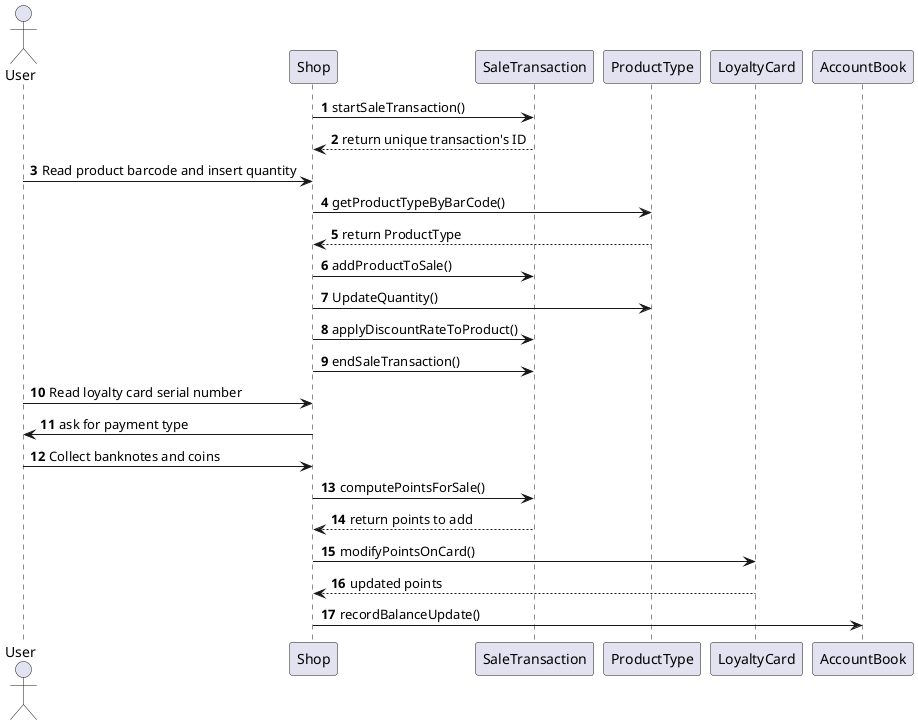
# UC8 - Manage return transaction
### Scenario 8.1/8.2 - Return transaction of product type X completed (credit card/cash)

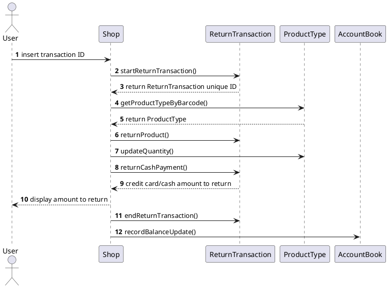
# UC9 - Accounting 
## Scenario 9.1 - List credits and debits

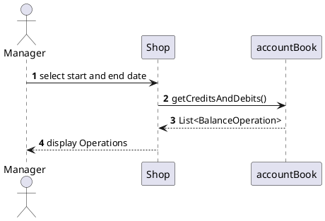
