# Graphical User Interface Prototype  

Authors:

Date:

Version:

\<Report here the GUI that you propose. You are free to organize it as you prefer. A suggested presentation matches the Use cases and scenarios defined in the Requirement document. The GUI can be shown as a sequence of graphical files (jpg, png)  >

# Login 

Before every Use Case, users have to do the login, with which they enters in the EZShop application.

### 1) 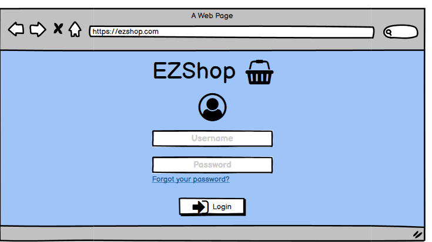
### 2) 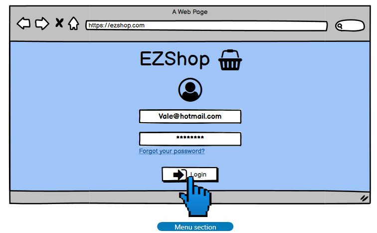
### 3) 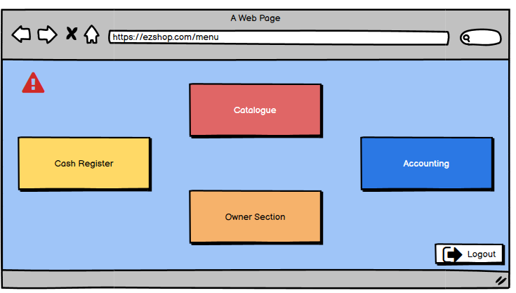

Depending on their role(s), they will have access to specific sections of the application:
 - Shop owner: all sections.
 - Cashier: cash register.
 - Inventory manager: catalogue.
 - Accounting administrator: accounting.

### Forgot password

In case a user forgives their password, they can request for a new password giving their email.

### 1) 
### 2) 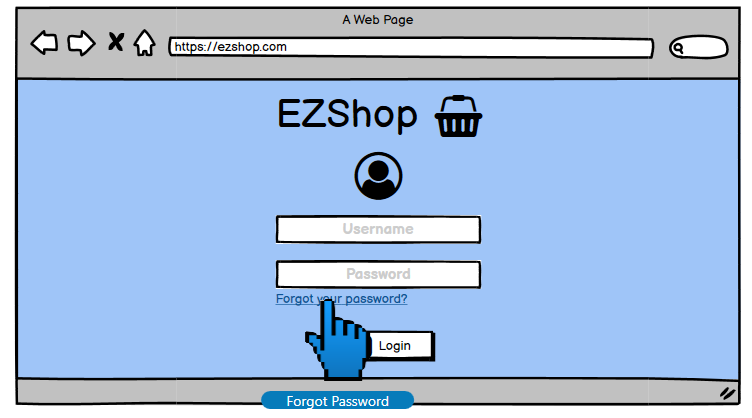
### 3) 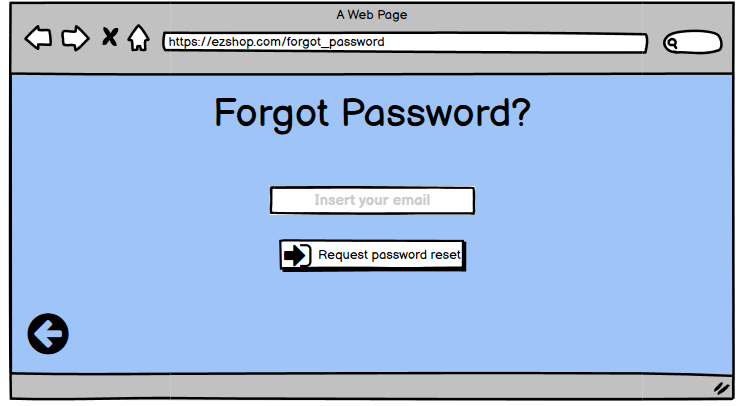

They will receive an email with a link to a page where they can reset their password.

### 4) 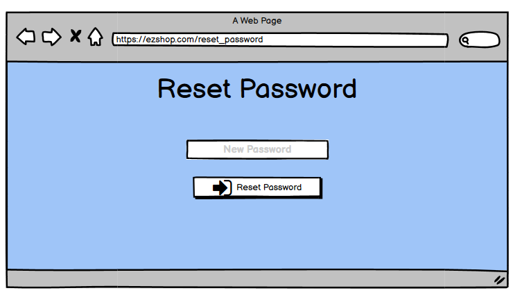

# UC1: Customer buys items
## Nominal Scenario
### 1) 
### 2) 
### Cashier scans items
### 3) 
### 4) 
### Cash register prints the receipt; return to point 2, ready for another transaction.

## Variant 1 - Scenario 1.1 - Customer with fidelity card
### (Same until point 3 in the Nominal Scenario)
### Cashier scans fidelity card
### 
### (Same after point 3 in the Nominal Scenario)

## Variant 2 - Scenario 1.2 - Payment failure
### (Same until point 2 in the Nominal Scenario)
### 
### 
### Return to point 2 in the Nominal Scenario, ready for another transaction.

# UC2: Shop owner/Inventory manager updates quantity of item in inventory
## Nominal Scenario
### 1) 
### 2) 
### User searches for the item (i.e., Vans ComfyCush)
### 3) 
### 4) 
### 5) 

# UC3: Shop owner/Inventory manager changes threshold
## Nominal Scenario
### 1) 
### 2) 
### 3) 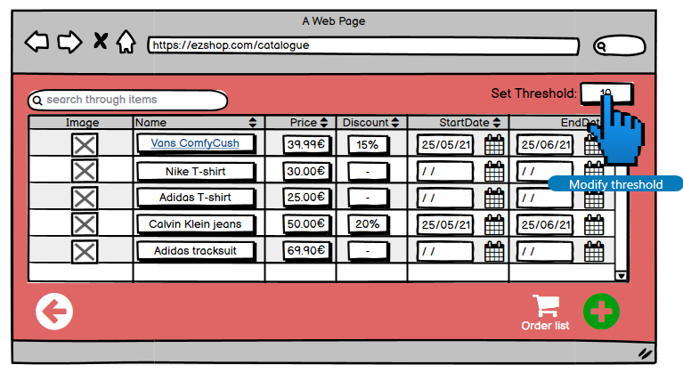

# UC9: Register fidelity card
## Nominal Scenario
### 1) 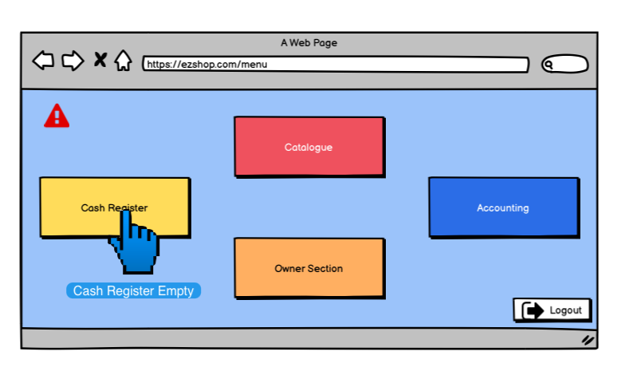
### 2) 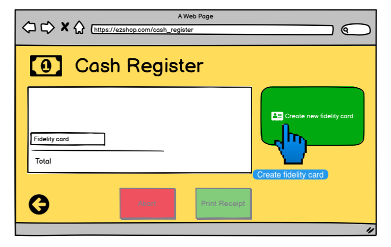
### 3) 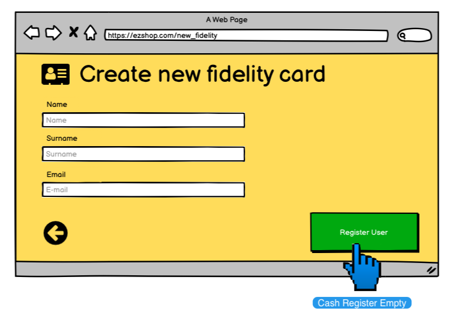
### Return to point 2, ready to create another fidelity card.

# UC10: Shop owner adds/removes employee
## Nominal Scenario
### 1) 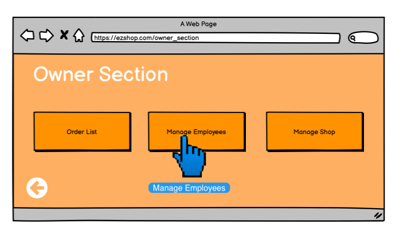
### Add Employee
### 2) 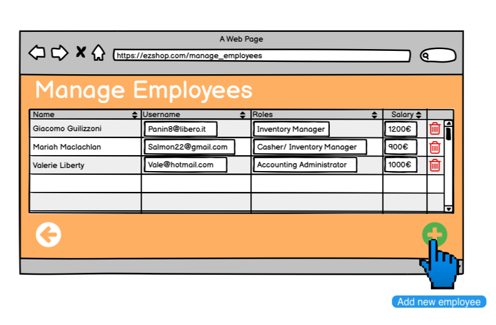
### 3) 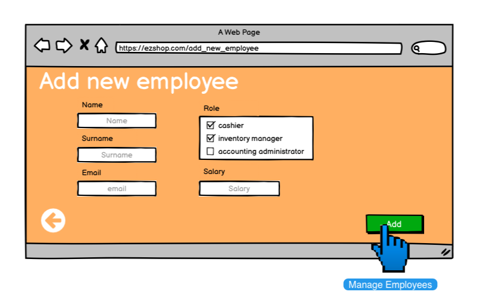
### Remove Emlpoyee (starts from point 1)
### 1) 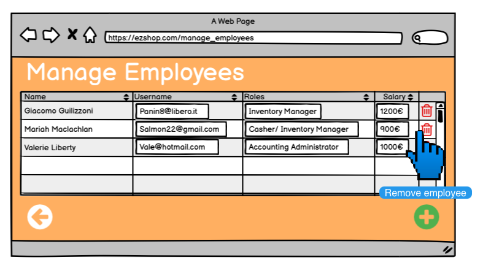
### 2) 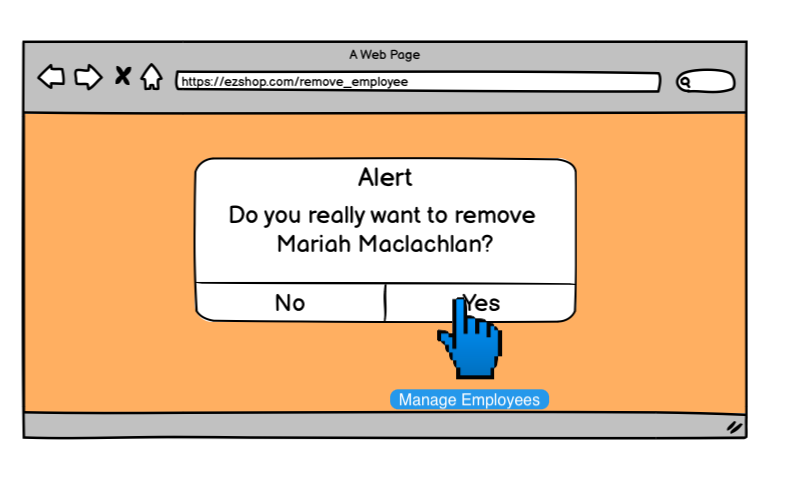
### After confirmation the application returns to Manage Employee section

# UC11: Shop owner changes employee's information
## Nominal Scenario
### 1) 
### 2) 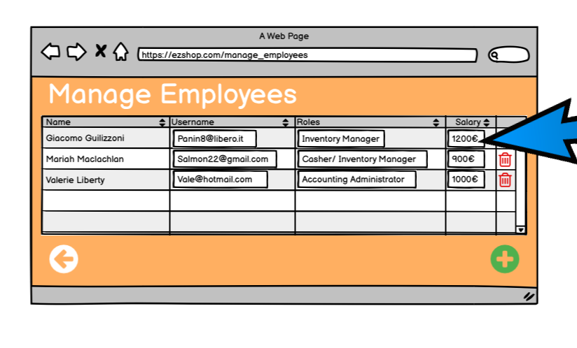
### Owner selects which field to update

# UCX: Owner sees notifications
## Nominal Scenario 
### 1) 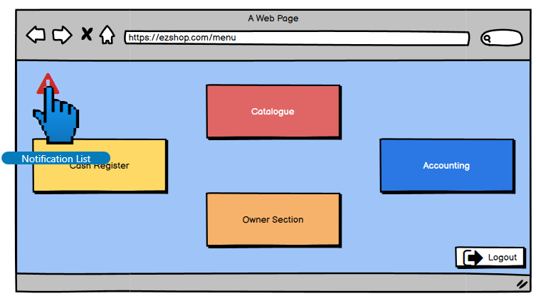
### 2) 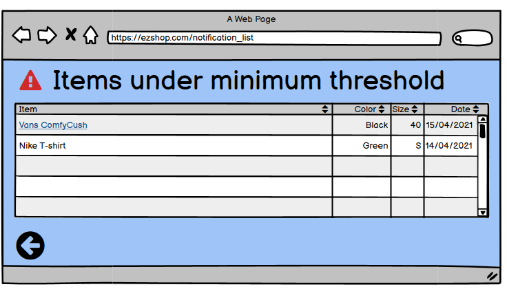

# UC13: Add transaction related to the shop
## Nominal Scenario
### 1) 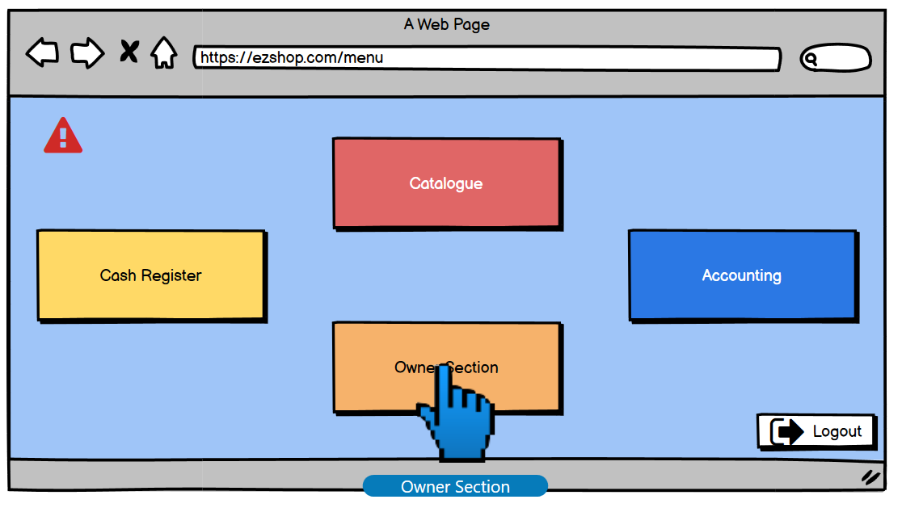
### 2) 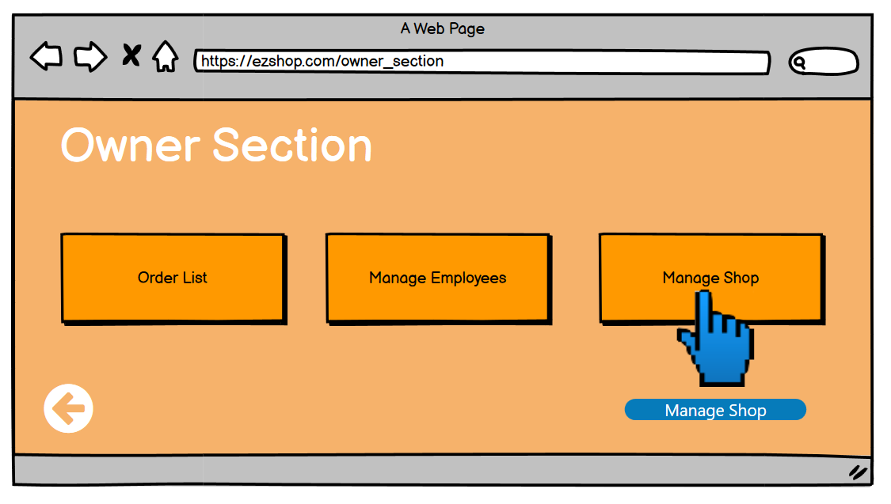
### Owner insert data about a specific transaction and add it to the accounting section
### 3) 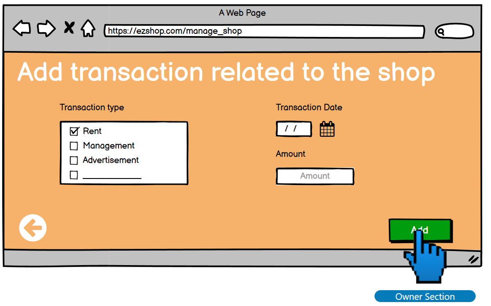

# UC14: Analize profits/losses
## Nominal Scenario
### 1) 
### 2) 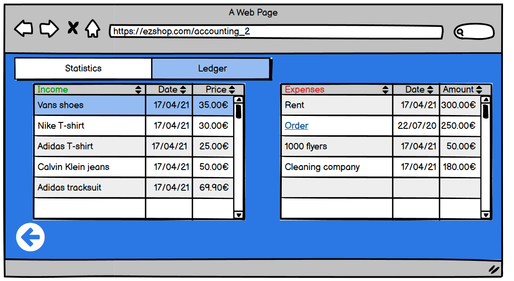
### User can switch and see also shop statistics 
### 3) 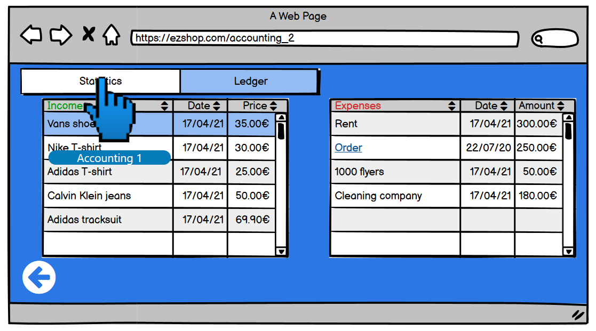
### 4) 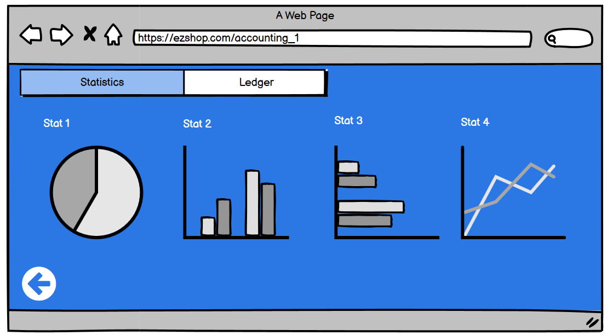

