# Graphical User Interface Prototype  

Authors:

Date:

Version:

\<Report here the GUI that you propose. You are free to organize it as you prefer. A suggested presentation matches the Use cases and scenarios defined in the Requirement document. The GUI can be shown as a sequence of graphical files (jpg, png)  >

# UC1: Customer buys items
## Nominal Scenario
### 1) 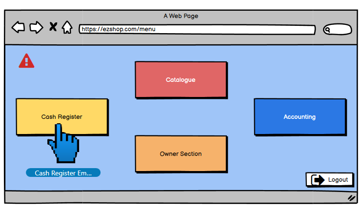
### 2) 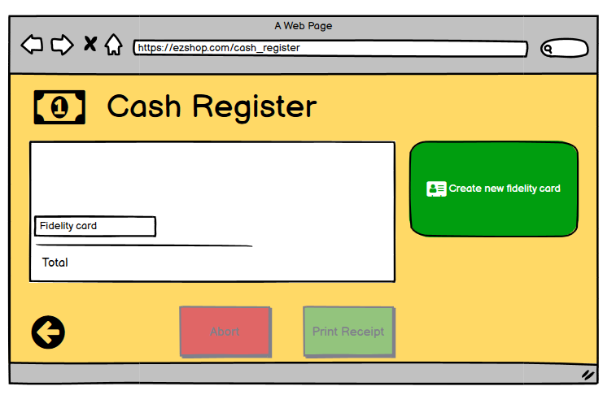
### Cashier scans items
### 3) 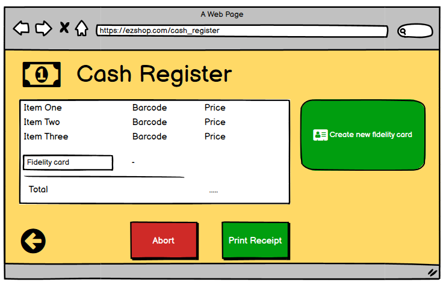
### 4) 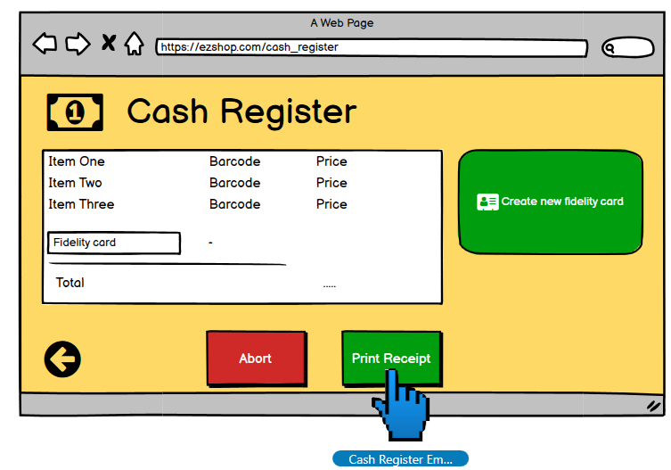
### Cash register prints the receipt; return to point 2, ready for another transaction.

## Variant 1 - Scenario 1.1
### (Same until point 3 in the Nominal Scenario)
### Cashier scans fidelity card
### 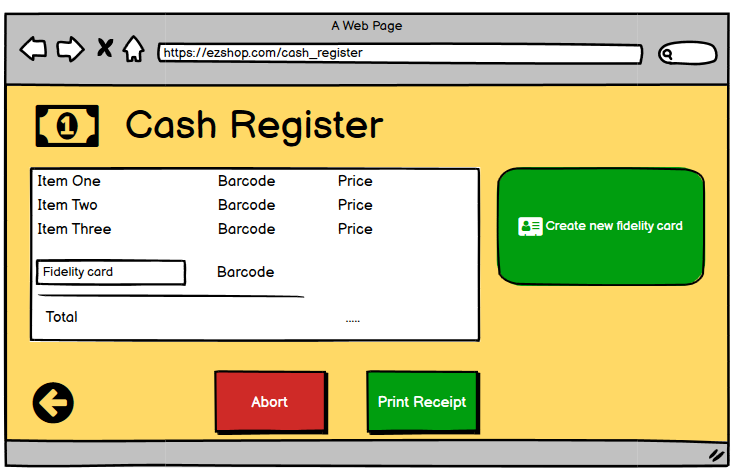
### (Same after point 3 in the Nominal Scenario)

## Variant 2 - Scenario 1.2
### (Same until point 2 in the Nominal Scenario)
### 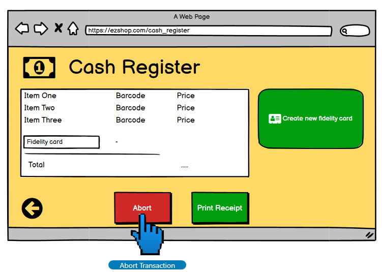
### 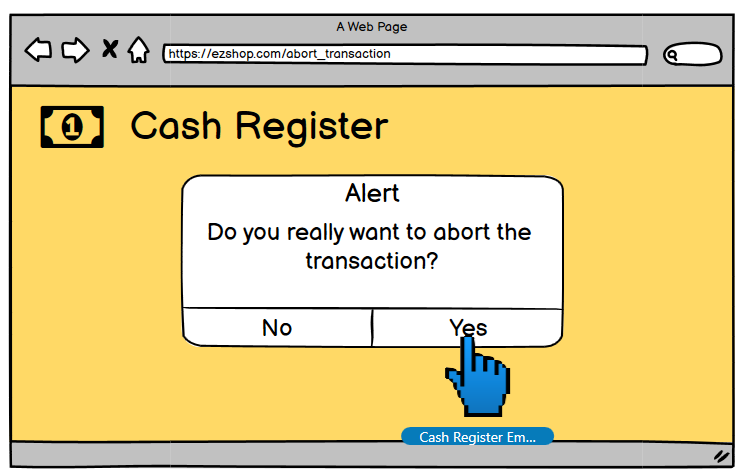
### Return to point 2 in the Nominal Scenario, ready for another transaction.

# UC2: Shop owner/Inventory manager updates quantity of item in inventory
## Nominal Scenario
### 1) 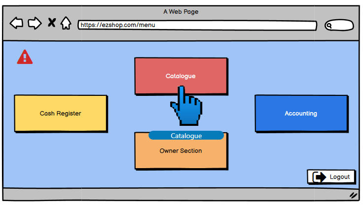
### 2) 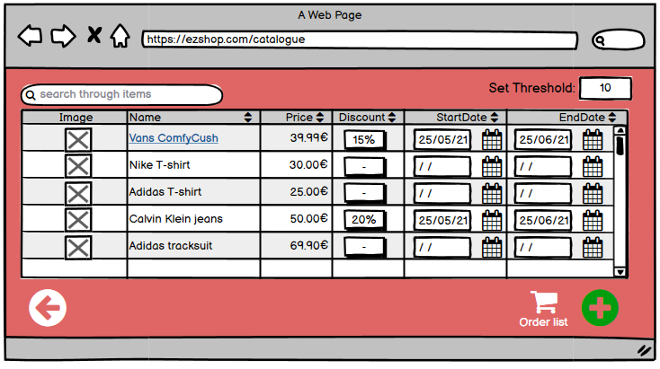
### User searches for the item (i.e., Vans ComfyCush)
### 3) 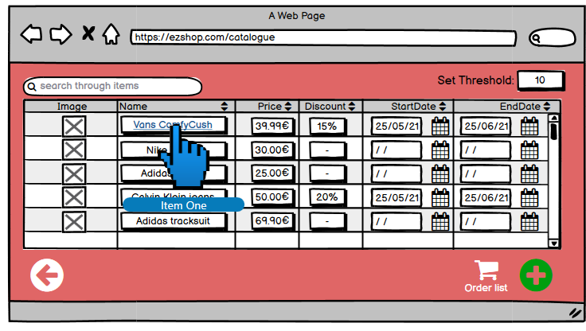
### 4) 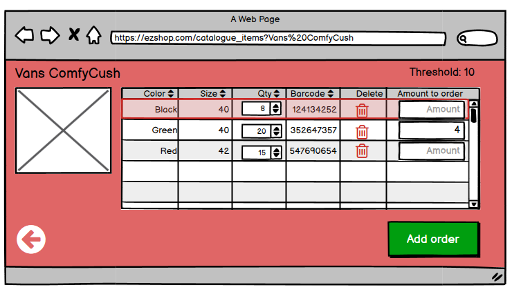
### 5) 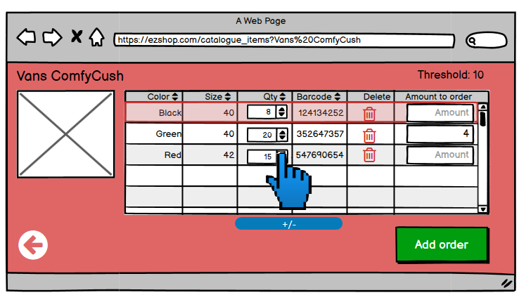

