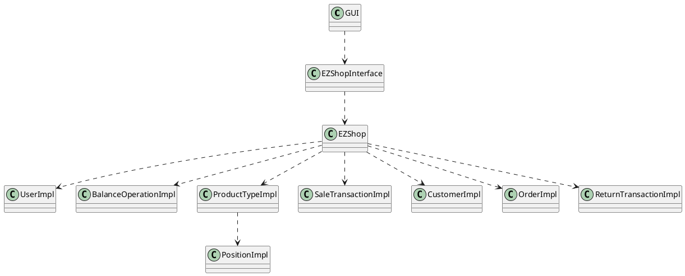

# Integration and API Test Documentation

Authors:

Date:

Version:

# Contents

- [Dependency graph](#dependency graph)

- [Integration and API Test Documentation](#integration-and-api-test-documentation)
- [Contents](#contents)
- [Dependency graph](#dependency-graph)
- [Integration approach](#integration-approach)
- [Tests](#tests)
  - [Step 1](#step-1)
  - [Step 2](#step-2)
  - [Step n](#step-n)
- [Scenarios](#scenarios)
  - [Scenario 1-4](#scenario-1-4)
  - [Scenario 1-5](#scenario-1-5)
  - [Scenario 2-4](#scenario-2-4)
  - [Scenario 3-4](#scenario-3-4)
  - [Scenario 3-5](#scenario-3-5)
  - [Scenario 4-5](#scenario-4-5)
  - [Scenario 6-7](#scenario-6-7)
- [Coverage of Scenarios and FR](#coverage-of-scenarios-and-fr)
- [Coverage of Non Functional Requirements](#coverage-of-non-functional-requirements)
    - 

- [Tests](#tests)

- [Scenarios](#scenarios)

- [Coverage of scenarios and FR](#scenario-coverage)
- [Coverage of non-functional requirements](#nfr-coverage)

# Dependency graph 

     <report the here the dependency graph of the classes in EzShop, using plantuml>
     

# Integration approach

    <Write here the integration sequence you adopted, in general terms (top down, bottom up, mixed) and as sequence
    (ex: step1: class A, step 2: class A+B, step 3: class A+B+C, etc)> 
    <Some steps may  correspond to unit testing (ex step1 in ex above), presented in other document UnitTestReport.md>
    <One step will  correspond to API testing>
    
Bottom up approach  

step1: class UserImpl, class BalanceOperationImpl, class ProductTypeImpl, class TicketEntryImpl, class SaleTransactionImpl, class CustomerImpl, class OrderImpl, class ReturnTransactionImpl, class PositionImpl (Unit test)
  
step 2: class EZShop + class UserImpl, class BalanceOperationImpl, class ProductTypeImpl, class SaleTransactionImpl, class CustomerImpl, class OrderImpl, class ReturnTransactionImpl, class PositionImpl
  

#  Tests

   <define below a table for each integration step. For each integration step report the group of classes under test, and the names of
     JUnit test cases applied to them> JUnit test classes should be here src/test/java/it/polito/ezshop

## Step 1
| Classes               | JUnit test cases           |
| --------------------- | -------------------------- |
| UserImpl              | UserClassTest              |
| BalanceOperationImpl  | BalanceOperationClassTest  |
| ProductTypeImpl       | ProductTypeClassTest       |
| SaleTransactionImpl   | SaleTransactionClassTest   |
| CustomerImpl          | CustomerClassTest          |
| OrderImpl             | OrderClassTest             |
| ReturnTransactionImpl | ReturnTransactionClassTest |
| PositionImpl          | PositionClassTest          |
| TicketEntryImpl       | TicketEntryClassTest       |

## Step 2
| Classes | JUnit test cases |
| ------- | ---------------- |
| EZShop  | EZShopClassTest  |

## Step n 

   

| Classes | JUnit test cases |
| ------- | ---------------- |
|         |                  |

# Scenarios

<If needed, define here additional scenarios for the application. Scenarios should be named
 referring the UC in the OfficialRequirements that they detail>

## Scenario 1-4

| Scenario       |        Delete product type         |
| -------------- | :--------------------------------: |
| Precondition   | Employee C exists and is logged in |
|                |       Product type X exists        |
| Post condition |       Product type X deleted       |
| Step#          |            Description             |
| 1              |     C searches X via bar code      |
| 2              |             C delete X             |

## Scenario 1-5

| Scenario       |           List all product types            |
| -------------- | :-----------------------------------------: |
| Precondition   |     Employee C exists and is logged in      |
| Post condition |          List of all product types          |
| Step#          |                 Description                 |
| 1              | C asks the system to list all product types |

## Scenario 2-4

| Scenario       |           List all users            |
| -------------- | :---------------------------------: |
| Precondition   |   Admin A exists and is logged in   |
| Post condition |       List of users retrieved       |
| Step#          |             Description             |
| 1              | A asks the system to list all users |

## Scenario 3-4

| Scenario       |              Order of product type X sent and payed               |
| -------------- | :---------------------------------------------------------------: |
| Precondition   |               ShopManager S exists and is logged in               |
|                |                       Product type X exists                       |
| Post condition |               Order O exists and is in PAYED state                |
|                |            Balance -= Order.units * Order.pricePerUnit            |
|                |                        X.units not changed                        |
| Step#          |                            Description                            |
| 1              |                         S creates order O                         |
| 2              | S fills  quantity of product to be ordered and the price per unit |
| 3              |                   S register payment done for O                   |
| 4              |            O is recorded in the system in PAYED state             |

## Scenario 3-5

| Scenario      |            List All Orders            |
| ------------- | :-----------------------------------: |
| Precondition  | ShopManager S exists and is logged in |
| Postcondition |          List of all orders           |
| Step#         |              Description              |
| 1             | C asks the system to list all orders  |

## Scenario 4-5

| Scenario       |       Delete customer record       |
| -------------- | :--------------------------------: |
| Precondition   | Account U for Customer Cu existing |
| Post condition |    U is deleted from the system    |
| Step#          |            Description             |
| 1              |   User selects customer record U   |
| 2              |   User deletes customer record U   |

## Scenario 6-7 

| Scenario       | Sale of product type X completed with product deleted from sale |
| -------------- | :-------------------------------------------------------------: |
| Precondition   |                Cashier C exists and is logged in                |
|                | Product type X exists and has enough units to complete the sale |
| Post condition |                    Balance += N*X.unitPrice                     |
|                |                         X.quantity -= N                         |
| Step#          |                           Description                           |
| 1              |                 C starts a new sale transaction                 |
| 2              |                      C reads bar code of X                      |
| 3              |                 C adds N units of X to the sale                 |
| 4              |             X available quantity is decreased by N              |
| 5              |                      C reads bar code of Y                      |
| 6              |               C deletes N units of Y to the sale                |
| 7              |             Y available quantity is increased by N              |
| 8              |                  C closes the sale transaction                  |
| 9              |                    System asks payment type                     |
| 10             |                    Manage  payment (see UC7)                    |
| 11             |                       Payment successful                        |
| 12             |         C confirms the sale and prints the sale Ticket          |
| 13             |                       Balance is updated                        |

# Coverage of Scenarios and FR

<Report in the following table the coverage of  scenarios (from official requirements and from above) vs FR. 
Report also for each of the scenarios the (one or more) API JUnit tests that cover it. >

| Scenario ID | Functional Requirements covered                                                           | JUnit  Test (s)                    |
| ----------- | ----------------------------------------------------------------------------------------- | ---------------------------------- |
| 1-1         | FR3.1                                                                                     | UC1TestClass: testCaseScenario1_1, |
| 1-2         | FR3.4, FR4.2                                                                              | UC1TestClass: testCaseScenario1_2, |
| 1-3         | FR3.4, FR3.1                                                                              | UC1TestClass: testCaseScenario1_3, |
| 1-4         | FR3.4, FR3.2                                                                              | UC1TestClass: testCaseScenario1_4, |
| 1-5         | FR3.3                                                                                     | UC1TestClass: testCaseScenario1_5, |
| 2-1         | FR1.1, FR1.5                                                                              |                                    |
| 2-2         | FR1.4, FR1.2                                                                              |                                    |
| 2-3         | FR1.4, FR1.5                                                                              |                                    |
| 2-4         | FR1.3                                                                                     |                                    |
| 3-1         | FR4.3                                                                                     | UC3TestClass: testCaseScenario3_1  |
| 3-2         | FR4.7, FR4.5, FR8.1, FR8.4                                                                | UC3TestClass: testCaseScenario3_2  |
| 3-3         | FR4.6, FR4.1                                                                              | UC3TestClass: testCaseScenario3_3  |
| 3-4         | FR4.4                                                                                     | UC3TestClass: testCaseScenario3_4  |
| 3-5         | FR4.7                                                                                     | UC3TestClass: testCaseScenario3_5  |
| 4-1         | FR5.1                                                                                     |                                    |
| 4-2         | FR5.5, FR5.3, FR5.6                                                                       |                                    |
| 4-3         | FR5.3, FR5.1                                                                              |                                    |
| 4-4         | FR5.3, FR5.1                                                                              |                                    |
| 4-5         | FR5.3, FR5.2                                                                              |                                    |
| 5-1         |                                                                                           |                                    |
| 5-2         |                                                                                           |                                    |
| 6-1         | FR6.1, FR6.7, FR6.2, FR4.1, FR6.10, FR7.1/7.2, FR6.8, FR6.11, FR8.2, FR8.4                |                                    |
| 6-2         | FR6.1, FR6.7, FR6.2, FR4.1, FR6.5, FR6.10, FR7.1/7.2, FR6.8, FR6.11, FR8.2, FR8.4         |                                    |
| 6-3         | FR6.1, FR6.7, FR6.2, FR4.1, FR6.4, FR6.10, FR7.1/7.2, FR6.8, FR6.11, FR8.2, FR6.11, FR8.4 |                                    |
| 6-4         | FR6.1, FR6.7, FR6.2, FR4.1, FR6.10, FR7.1/7.2, FR6.6, FR5.7, FR6.8, FR6.11, FR8.2, FR8.4  |                                    |
| 6-5         | FR6.1, FR6.7, FR6.2, FR4.1, FR6.10                                                        |                                    |
| 6-6         | FR6.1, FR6.7, FR6.2, FR4.1, FR6.10, FR7.1, FR6.8, FR6.11, FR8.2, FR8.4                    |                                    |
| 6-7         | FR6.1, FR6.7, FR6.2, FR4.1, FR6.3, FR6.10, FR7.1/7.2, FR6.8, FR6.11, FR8.2, FR8.4         |                                    |
| 7-1         | FR7.2                                                                                     |                                    |
| 7-2         |                                                                                           |                                    |
| 7-3         |                                                                                           |                                    |
| 7-4         | FR7.1                                                                                     |                                    |
| 8-1         | FR6.9, FR6.12, FR6.7, FR6.13, FR4.1, FR7.4, FR6.14, FR6.15, FR8.4                         |                                    |
| 8-2         | FR6.9, FR6.12, FR6.7, FR6.13, FR4.1, FR7.3, FR6.14, FR6.15, FR8.4                         |                                    |
| 9-1         | FR8.3                                                                                     | UC9TestClass: testCaseScenario9_1  |
| 10-1        | FR7.4                                                                                     |                                    |
| 10-2        | FR7.3                                                                                     |                                    |

# Coverage of Non Functional Requirements

<Report in the following table the coverage of the Non Functional Requirements of the application - only those that can be tested with automated testing frameworks.>

### 

| Non Functional Requirement | Test name                                                                                                                                                                                                                                |
| -------------------------- | ---------------------------------------------------------------------------------------------------------------------------------------------------------------------------------------------------------------------------------------- |
| NFR3                       | See 'response time' in every test case in src/test/java/it/polito/ezshop/scenariosTests                                                                                                                                                  |
| NFR4                       | UC1TestClass: Scenario1_1TestCase, ExceptionsScenario1_1TestCase - test cases including checks for every case of validity and invalidity   EZShopClassTest: testCase6 - test case for the check only of the validity of the algorithm |
| NFR5                       | EZShopClassTest: testCase7                                                                                                                                                                                                               |

