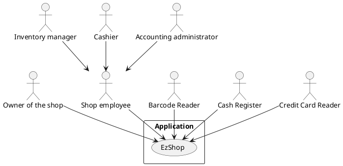
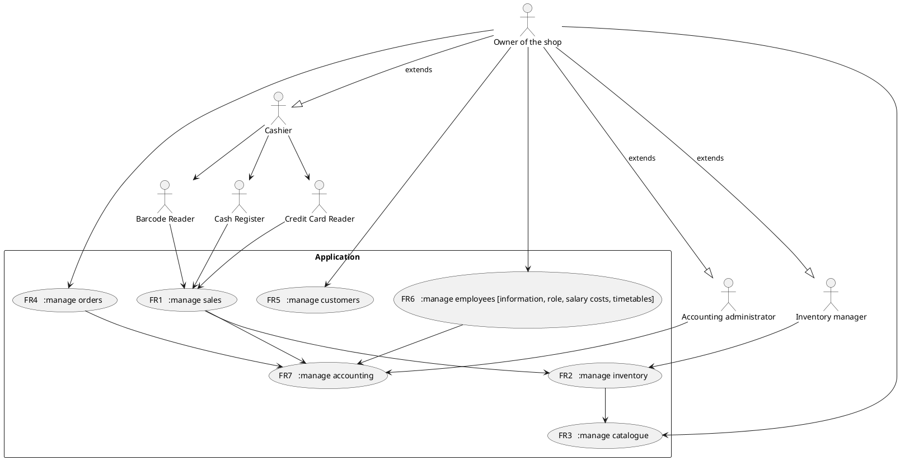
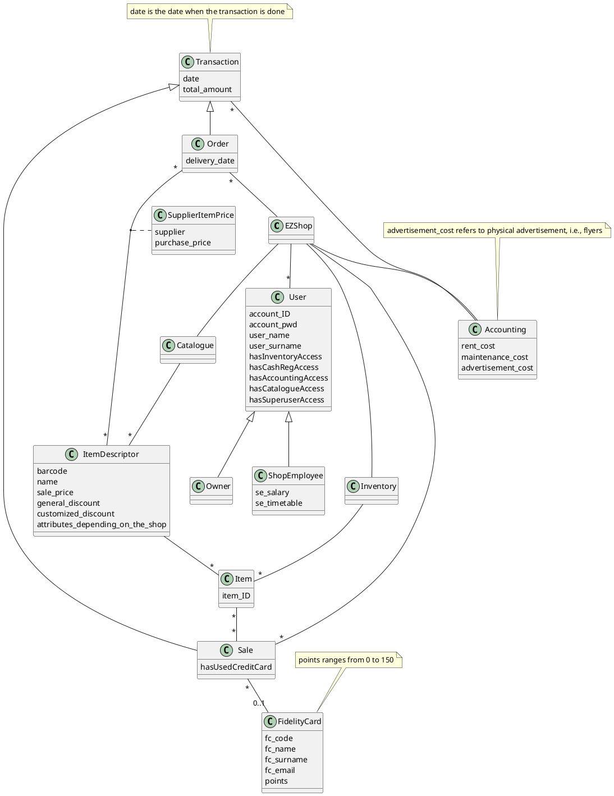
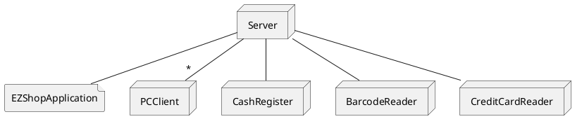

# Requirements Document 

Authors: Elia Fontana, Andrea Palomba, Leonardo Perugini, Francesco Sattolo

Date: 06/04/2021

Version: 1.0

# Contents

- [Requirements Document](#requirements-document)
- [Contents](#contents)
- [Essential description](#essential-description)
- [Stakeholders](#stakeholders)
- [Context Diagram and interfaces](#context-diagram-and-interfaces)
  - [Context Diagram](#context-diagram)
  - [Interfaces](#interfaces)
- [Stories and personas](#stories-and-personas)
- [Functional and non functional requirements](#functional-and-non-functional-requirements)
  - [Functional Requirements](#functional-requirements)
  - [Non Functional Requirements](#non-functional-requirements)
- [Use case diagram and use cases](#use-case-diagram-and-use-cases)
  - [Use case diagram](#use-case-diagram)
    - [Use case 1, FR1 customer buys item](#use-case-1-fr1-customer-buys-item)
        - [Scenario 1.1, customer with fidelity card](#scenario-11-customer-with-fidelity-card)
        - [Scenario 1.2, payment failure](#scenario-12-payment-failure)
    - [Use case 2, FR2.1, shop owner/shop employee updates inventory](#use-case-2-fr21-shop-ownershop-employee-updates-inventory)
        - [Scenario2.1, order arrives](#scenario21-order-arrives)
        - [Scenario2.2, sale completed](#scenario22-sale-completed)
    - [Use case 3, FR2.3, shop owner/inventory manager searches for a product](#use-case-3-fr23-shop-ownerinventory-manager-searches-for-a-product)
    - [Use case 4, FR3.1, shop owner applies a promotion to a certain item](#use-case-4-fr31-shop-owner-applies-a-promotion-to-a-certain-item)
    - [Use case 5, FR3.2 shop owner handles item in catalogue](#use-case-5-fr32-shop-owner-handles-item-in-catalogue)
        - [Scenario5.1, shop owner remove an item from catalogue](#scenario51-shop-owner-remove-an-item-from-catalogue)
        - [Scenario5.2, shop owner add an item to catalogue](#scenario52-shop-owner-add-an-item-to-catalogue)
    - [Use case 6, FR4, shop owner/inventory manager places an order](#use-case-6-fr4-shop-ownerinventory-manager-places-an-order)
        - [Scenario6.1, payment failure](#scenario61-payment-failure)
    - [Use case 7, FR 5.2 Send customized offers](#use-case-7-fr-52-send-customized-offers)
    - [Use case 8, Register fidelity card](#use-case-8-register-fidelity-card)
    - [Use case 9, FR6, shop owner changes employee's contract](#use-case-9-fr6-shop-owner-changes-employees-contract)
    - [Use case 10, FR6, shop owner adds/removes employee](#use-case-10-fr6-shop-owner-addsremoves-employee)
    - [Use case 11, FR7.1 log information about the shop (rent,maintenance,advertisement costs)](#use-case-11-fr71-log-information-about-the-shop-rentmaintenanceadvertisement-costs)
    - [Use case 12, FR7.2 analize profits/losses](#use-case-12-fr72-analize-profitslosses)
- [Glossary](#glossary)
- [System Design](#system-design)
- [Deployment Diagram](#deployment-diagram)

# Essential description

Small shops require a simple application to support the owner or manager. A small shop (ex a food shop) occupies 50-200 square meters, sells 500-2000 different item types, has one or a few cash registers 
EZShop is a software application to:
* manage sales
* manage inventory
* manage customers
* support accounting

# Stakeholders

| Stakeholder name         |                                                                 Description                                                                  |
| ------------------------ | :------------------------------------------------------------------------------------------------------------------------------------------: |
| Owner of the shop        |                                                  Manages all of the shop related activities                                                  |
| Cashier                  |                          Interacts with the customer and manages sales (can be the owner or another shop employee)                           |
| Inventory manager        |                                      Manages the inventory (can be the owner or another shop employee)                                       |
| Accounting administrator |                                      Manages the accounting (can be the owner or another shop employee)                                      |
| Computer Engineer        | Create and maintain the application (us) and support the user of the application in case of problems (IT, database, security administrators) |
| BarCode Reader           |                                    scans barcode of the products and sends information to the application                                    |
| Cash Register            |                                                            manages cash payments                                                             |
| Credit Card Reader       |                                                         manages credit card payments                                                         |

# Context Diagram and interfaces

## Context Diagram

## Interfaces

| Actor                    |      Logical Interface       |          Physical Interface |
| ------------------------ | :--------------------------: | --------------------------: |
| Owner of the shop        |   Application GUI (admin)    | Screen keyboard mouse on PC |
| Cashier                  |  Application GUI (cashier)   | Screen keyboard mouse on PC |
| Inventory manager        | Application GUI (inventory)  | Screen keyboard mouse on PC |
| Accounting administrator | Application GUI (accounting) | Screen keyboard mouse on PC |
| Barcode Reader           |       Barcode API  ???       |                             |
| Cash Register            |    Cash Register API  ???    |                             |
| Credit Card Reader       | Credit Card Reader API  ???  |               internet link |

# Stories and personas

Owner:
-Roberto is a man who used his life savings to buy a small shop. He needs to be able to manage all the aspects of the activity in a simple and centralized way. 
He is happy to do any of the roles required, but likes to focus more on managing the catalogue, the orders, and thinking about customers promotions.
For this reason he hired his friend Amanda, which usually works as a cashier, but can also manage the inventory when Roberto is not available.
He also need to keep track of incomes and expenses, but since he is not very good with them, he pays Paolo, a very good accounting adiministrator, to help him with this task. Since Roberto is not an expert, he prefers seeing graphs than spreadsheets.

Employee:
-Amanda loves to interact with customers, so she needs a fast application to manage sales quickly and don't make them wait. She is not very good with technology though, so she need a simple application to manage the inventory without errors, even when Roberto is not around.

Owner:
-Tom is 49 years, he is a great seller and like dealing with customers, but don't like much tecnology, so want an application that is simply to use.
His employees work for him since 10 years so he trust them in managing accounting and inventory; however at thesame time  when there are no client 
in the shop, sometime he take a look to warehouse about missing things because detest when a client don't find what is looking for. 
He also like to have in storehouse all the latest releases so he update than really frequently.

-Bill is 28 years, he bought the shop few months ago. 
He is a precise person, so want to have control about all the aspect of the entire shop, in particular about the accounting part; he also would 
like to have statistic about sales in order to try to increase the shop profits.
He have a family with 3 children, so often he can't be physically in the shop and he like to monitoring the situation at any time with 
his portable/(smartphone?).

Employee:
-Max is 23 years, he has not a lot experience about how to manage a shop inventory so he really like the  idea to use an application that help him doing
his job; he is also heedless so is very happy to reach notification about the status of the inventory (when something is going to finish).
Fortunately also the supervisor may access to the inventory an control that everything in fine.

# Functional and non functional requirements

## Functional Requirements

| ID    |                          Description                          |
| ----- | :-----------------------------------------------------------: |
| FR1   |                         manage sales                          |
| FR1.1 |                        log sales data                         |
| FR1.2 | Barcode reader, cash register, credit card reader integration |
| FR2   |                       manage inventory                        |
| FR2.1 |                     log inventory status                      |
| FR2.2 |              Add/Remove items to/from inventory               |
| FR2.3 |                Search through items (ordered)                 |
| FR2.4 |            Notice if item quantity under threshold            |
| FR3   |                       manage catalogue                        |
| FR3.1 |                log information about promotion                |
| FR3.2 |              Add/Remove items to/from catalogue               |
| FR3.3 |                Search through items (ordered)                 |
| FR4   |                         manage orders                         |
| FR4.1 |                log information about suppliers                |
| FR4.2 |                   Add/Remove items to order                   |
| FR4.3 |                Send order and pay the supplier                |
| FR5   |                       manage customers                        |
| FR5.1 |                    register fidelity cards                    |
| FR5.2 |            Send customized offers (advertisements)            |
| FR6   |                       manage employees                        |
| FR6.1 |                      Add/Remove Employee                      |
| FR6.2 |                  Update Employee information                  |
| FR7   |                       manage accounting                       |
| FR7.1 |                log information about the shop                 |
| FR7.2 |                    analize profits/losses                     |
| FR8   |      never store credit card number for security reasons      |

## Non Functional Requirements

\<Describe constraints on functional requirements>

| ID   | Type (efficiency, reliability, .. see iso 9126) |                                     Description                                     |   Refers to FR |
| ---- | :---------------------------------------------: | :---------------------------------------------------------------------------------: | -------------: |
| NFR1 |                    usability                    | The owner must learn to use all the functions within 30 minutes of training session |            all |
| NFR2 |                   efficiency                    |                   every function must have <0.1 ms response time                    | easy functions |
| NFR2 |                   efficiency                    |                     every function must have <1 s response time                     | hard functions |
| NFR3 |                 maintainability                 |                              add new functionalities?                               |            all |
| NFR4 |                   reliability                   |                      bugfixes must be completed within 1 week                       |            all |
| NFR4 |                  availability                   |                                     uptime 99%                                      |            all |
| NFR5 |                    security                     |            Restrict different views of the GUI only to authorized people            |            all |
| NFR6 |                     domain                      |               Possibility to change currency (euro,dollar), language                |                |

# Use case diagram and use cases

## Use case diagram

### Use case 1, FR1 customer buys item

| Actors Involved  |                                   shop employee                                    |
| ---------------- | :--------------------------------------------------------------------------------: |
| Precondition     |                                 item in inventory                                  |
| Post condition   | item sold, amount of items in inventory updated, gains updated, transaction logged |
|                  |                                                                                    |
| Nominal Scenario |                                                                                    |
|                  |                          1. Shop employee scans products                           |
|                  |                           2. Applying general promotions                           |
|                  |                                  3. Customer pays                                  |
|                  |                4. Application updates amount of items in inventory                 |
|                  |                                 5. Update database                                 |
|                  |                                                                                    |
| Variant1:        |                            customer with fidelity card                             |
| Variant2:        |                                  payment failure                                   |

##### Scenario 1.1, customer with fidelity card 

| Scenario ID: SC1 | Corresponds to UC 1                                                                |
| ---------------- | :--------------------------------------------------------------------------------- |
| Description      | customer with fidelity card                                                        |
| Precondition     | item in inventory, customer already registered in the system                       |
| Postcondition    | item sold, amount of items in inventory updated, gains updated, transaction logged |
| Step#            | Step description                                                                   |
| 1                | Accept client fidelity card                                                        |
| 2                | shop employee scans products                                                       |
| 3                | Apply general promotions                                                           |
| 4                | apply customized promotions                                                        |
| 5                | payment success                                                                    |
| 6                | Update amount of items in inventory and gains                                      |
| 7                | Update (add or subtract) customer's points                                         |
| 8                | Update customer's purchase history                                                 |

##### Scenario 1.2, payment failure

| Scenario ID: SC2 | Corresponds to UC 1          |
| ---------------- | :--------------------------- |
| Description      | payment failure              |
| Precondition     | item in inventory            |
| Postcondition    | transaction logged           |
| Step#            | Step description             |
| 1                | shop employee scans products |
| 2                | Applying general promotions  |
| 3                | payment failure              |
| 4                | Transaction aborted          |

### Use case 2, FR2.1, shop owner/shop employee updates inventory

| Actors Involved  |                 shop owner, inventory manager                  |
| ---------------- | :------------------------------------------------------------: |
| Precondition     |      inventory in consistent state, item is in catalogue       |
| Post condition   |                  inventory updated correctly                   |
|                  |                                                                |
| Nominal Scenario |                                                                |
|                  | 1. Shop owner/inventory manager searches through items (FR2.3) |
|                  |                                                                |
| Variant1         |                         order arrives                          |
| Variant2         |                         sale completed                         |

##### Scenario2.1, order arrives
| Scenario ID: SC2 | Corresponds to UC 1                                                      |
| ---------------- | :----------------------------------------------------------------------- |
| Description      | order arrives                                                            |
| Precondition     | order arrives                                                            |
| Postcondition    |                                                                          |
| Step#            | Step description                                                         |
| 1                | Shop owner/inventory manager searches through items (FR2.3)              |
| 2                | Shop owner/inventory manager adds/updates items in the inventory (FR2.2) |

##### Scenario2.2, sale completed

| Scenario ID: SC2 | Corresponds to UC 1                                                                                                    |
| ---------------- | :--------------------------------------------------------------------------------------------------------------------- |
| Description      | sale completed                                                                                                         |
| Precondition     | sale completed                                                                                                         |
| Postcondition    |                                                                                                                        |
| Step#            | Step description                                                                                                       |
| 1                | Shop owner/inventory manager searches through items (FR2.3)                                                            |
| 2                | Shop owner/inventory manager removes items in the inventory (FR2.2)                                                    |
| 3                | If one item amount drop under a certain threshold, Application sends a notification to the shop owner or shop employee |

### Use case 3, FR2.3, shop owner/inventory manager searches for a product

| Actors Involved  |             shop owner, inventory manager              |
| ---------------- | :----------------------------------------------------: |
| Precondition     |  inventory in consistent state, item is in catalogue   |
| Post condition   |                                                        |
|                  |                                                        |
| Nominal Scenario |                                                        |
|                  | 1. Shop owner/inventory manager searches through items |

### Use case 4, FR3.1, shop owner applies a promotion to a certain item                                          

| Actors Involved  |                              shop owner                               |
| ---------------- | :-------------------------------------------------------------------: |
| Precondition     |                     catalogue in consistent state                     |
| Post condition   |                         catalogue is updated                          |
|                  |                                                                       |
| Nominal Scenario |                                                                       |
|                  |                  1. Shop owner searches through item                  |
|                  |        2. Shop owner decide/select discount/promotion to apply        |
|                  | 3. Shop owner decide/select the starting and ending date of promotion |
|                  |                        4. Promotion is applied                        |

### Use case 5, FR3.2 shop owner handles item in catalogue
| Actors Involved  |       shop owner, shop employee        |
| ---------------- | :------------------------------------: |
| Precondition     | catalogue is update and work propertly |
| Post condition   |           catalogue updated            |
|                  |                                        |
| Nominal Scenario |                                        |
|                  |                                        |
| Variant1         |             remove an item             |
| Variant2         |              add an item               |

##### Scenario5.1, shop owner remove an item from catalogue

| Scenario ID: SC2 | Corresponds to UC 5                                |
| ---------------- | :------------------------------------------------- |
| Description      |                                                    |
| Precondition     |                                                    |
| Postcondition    |                                                    |
| Step#            |                                                    |
| 1                | Shop owner searches through item                   |
| 2                | Shop owner remove item from the catalogue          |
| 3                | Shop owner/employee remove item from the inventory |

##### Scenario5.2, shop owner add an item to catalogue

| Scenario ID: SC2 | Corresponds to UC 5                         |
| ---------------- | :------------------------------------------ |
| Description      |                                             |
| Precondition     |                                             |
| Postcondition    |                                             |
| Step#            |                                             |
| 1                | Shop owner adds product to the catalogue    |
| 2                | Shop owner/employee adds item to order list |

### Use case 6, FR4, shop owner/inventory manager places an order     

| Actors Involved  |                 shop owner, inventory manager                  |
| ---------------- | :------------------------------------------------------------: |
| Precondition     |      list size > minimum threshold, new item in catalogue      |
| Post condition   |           item added to order list, empty order list           |
|                  |                                                                |
| Nominal Scenario |                                                                |
|                  | 1. Shop owner/inventory manager searches through items (FR2.3) |
|                  |  2. Shop owner/inventory manager selects items and quantities  |
|                  |     3. Shop owner/inventory manager adds item to the list      |
|                  |                       4.Select supplier                        |
|                  |                         5. Order sent                          |
|                  |                       6. Payment succes                        |
|                  |               7. Order is placed to the supplier               |
|                  |                      8. Empty order list                       |
|                  |                                                                |
| Variant:         |                        payment failure                         |
##### Scenario6.1, payment failure

| Scenario ID: SC2 | Corresponds to UC 6 |
| ---------------- | :------------------ |
| Description      |                     |
| Precondition     |                     |
| Postcondition    | Full list           |
| Step#            | Step description    |
| 1                | Abort transaction   |

### Use case 7, FR 5.2 Send customized offers

| Actors Involved  |                                                                     |
| ---------------- | :-----------------------------------------------------------------: |
| Precondition     |                       Send customized offers                        |
| Post condition   |           Customer with fidelity card, promotions updated           |
|                  |                                                                     |
| Nominal Scenario |                                                                     |
|                  |     1. Application studies info about customer's past purchases     |
|                  |    2. Application selects n items constantly bought by customer     |
|                  | 3. promotions associated with one or more of those items is updates |
|                  |  4. Application send email to customer notifying those promotions   |

### Use case 8, Register fidelity card

| Scenario ID: SC2 |                Corresponds to UC 5                |
| ---------------- | :-----------------------------------------------: |
| Precondition     |           Customer wants fidelity card            |
| Postcondition    | Customer receives fidelity card, database updated |
|                  |                                                   |
| Nominal scenario |       1.Insert customer data into database        |

### Use case 9, FR6, shop owner changes employee's contract     

| Actors Involved  |                                      shop owner                                      |
| ---------------- | :----------------------------------------------------------------------------------: |
| Precondition     |                                                                                      |
| Post condition   |                       employee's information updated correctly                       |
|                  |                                                                                      |
| Nominal Scenario |                                                                                      |
|                  | 1. Shop owner updates employee information (role, timetable, salary) in the database |

### Use case 10, FR6, shop owner adds/removes employee     

| Actors Involved  |                        shop owner                         |
| ---------------- | :-------------------------------------------------------: |
| Precondition     |                                                           |
| Post condition   |         employee's information updated correctly          |
|                  |                                                           |
| Nominal Scenario |                                                           |
|                  |    1. Shop owner adds/removes employee in the database    |
|                  | 2. Shop owner adds/removes employee account to the system |

### Use case 11, FR7.1 log information about the shop (rent,maintenance,advertisement costs)

| Actors Involved  |             shop owner, accounting administrator             |
| ---------------- | :----------------------------------------------------------: |
| Precondition     |                   List of payment/incomes                    |
| Post condition   |                         List updated                         |
|                  |                                                              |
| Nominal Scenario |                                                              |
|                  | 1. Owner adds payment (rent,maintenance,advertisement costs) |
|                  |                  2. Calculate profit/losses                  |

### Use case 12, FR7.2 analize profits/losses

| Actors Involved  |              shop owner, accounting administrator              |
| ---------------- | :------------------------------------------------------------: |
| Precondition     | transaction database (incomes, expenses) in a consistent state |
| Post condition   |          system shows to the owner financial balance           |
|                  |                                                                |
| Nominal Scenario |                                                                |
|                  |     1. List all incomes and expenses (grouped by category)     |
|                  |           2. Show statistics about profit and losses           |

# Glossary

Definitions:
- Owner of the shop could also be just the manager of the shop.

# System Design

Payment terminal is already existing, we don't implement it.

# Deployment Diagram 

