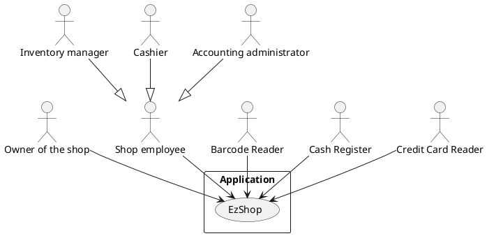
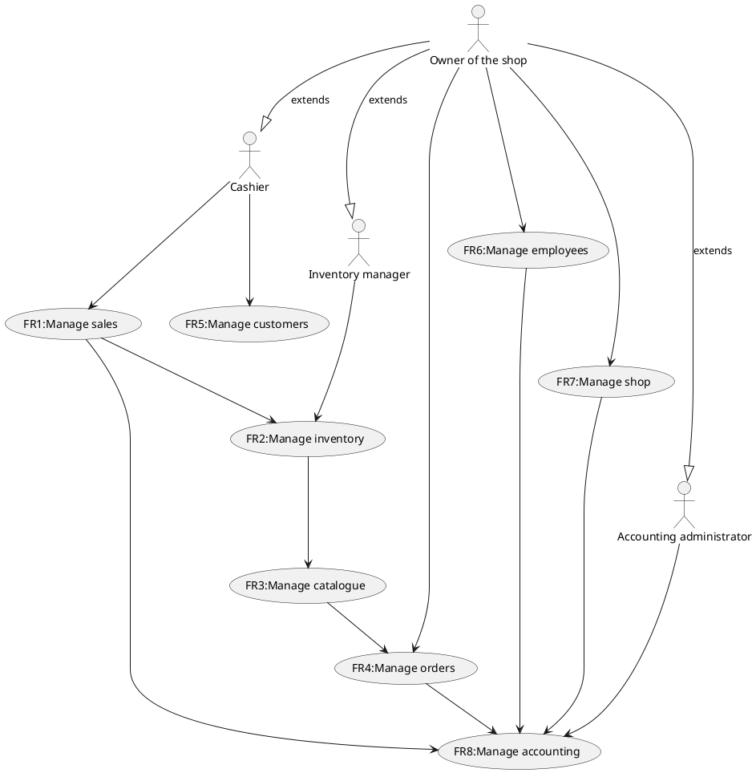
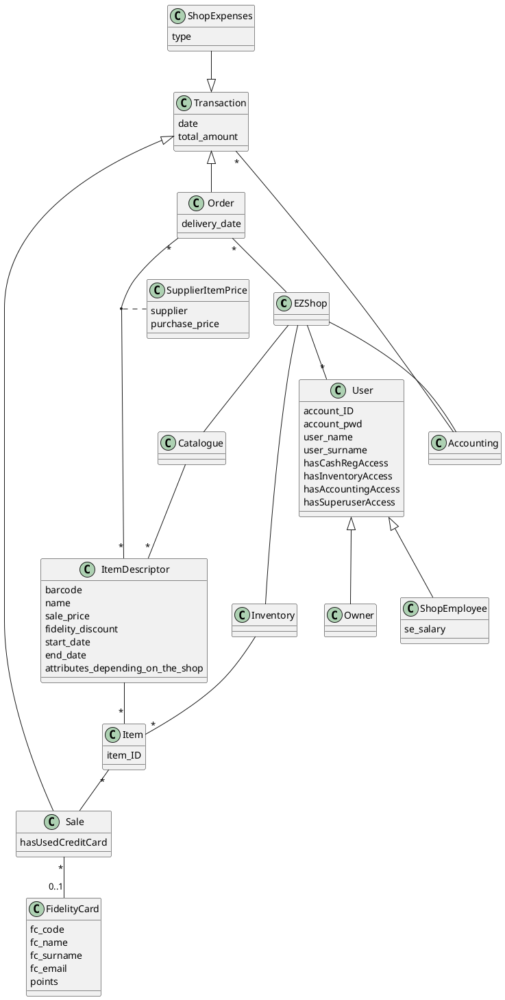
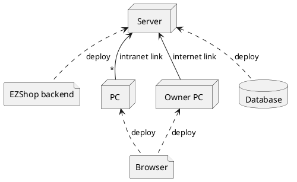

# Requirements Document 

Authors: Elia Fontana, Andrea Palomba, Leonardo Perugini, Francesco Sattolo

Date: 06/04/2021

Version: 1.0

# Contents

- [Requirements Document](#requirements-document)
- [Contents](#contents)
- [Essential description](#essential-description)
- [Stakeholders](#stakeholders)
- [Context Diagram and interfaces](#context-diagram-and-interfaces)
  - [Context Diagram](#context-diagram)
  - [Interfaces](#interfaces)
- [Stories and personas](#stories-and-personas)
- [Functional and non functional requirements](#functional-and-non-functional-requirements)
  - [Functional Requirements](#functional-requirements)
  - [Non Functional Requirements](#non-functional-requirements)
- [Use case diagram and use cases](#use-case-diagram-and-use-cases)
  - [Use case diagram](#use-case-diagram)
    - [Use case 1, FR1, Customer buys items](#use-case-1-fr1-customer-buys-items)
        - [Scenario 1.1](#scenario-11)
        - [Scenario 1.2](#scenario-12)
    - [Use case 2, FR2.1, Shop owner/Inventory manager updates quantity of item in inventory](#use-case-2-fr21-shop-ownerinventory-manager-updates-quantity-of-item-in-inventory)
    - [Use case 3, FR2.2, Display notifications of item's quantity under threshold](#use-case-3-fr22-display-notifications-of-items-quantity-under-threshold)
    - [Use case 4, FR2.3, Shop owner/Inventory manager changes threshold](#use-case-4-fr23-shop-ownerinventory-manager-changes-threshold)
    - [Use case 5, FR3.1, Shop owner/Inventory manager adds item to catalogue](#use-case-5-fr31-shop-ownerinventory-manager-adds-item-to-catalogue)
    - [Use case 6, FR3.2, Shop owner/Inventory manager removes item from catalogue](#use-case-6-fr32-shop-ownerinventory-manager-removes-item-from-catalogue)
    - [Use case 7, FR3.3, Shop owner/Inventory manager updates item information](#use-case-7-fr33-shop-ownerinventory-manager-updates-item-information)
        - [Scenario 7.1](#scenario-71)
    - [Use case 8, FR4.1, Shop owner/Inventory manager adds item to order](#use-case-8-fr41-shop-ownerinventory-manager-adds-item-to-order)
    - [Use case 9, FR4.2, Shop owner removes item from order](#use-case-9-fr42-shop-owner-removes-item-from-order)
    - [Use case 10, FR4.3, Shop owner places an order](#use-case-10-fr43-shop-owner-places-an-order)
    - [Use case 11, FR5.1, Register fidelity card](#use-case-11-fr51-register-fidelity-card)
    - [Use case 12, FR6.1, Shop owner adds/removes employee](#use-case-12-fr61-shop-owner-addsremoves-employee)
    - [Use case 13, FR6.2, Shop owner changes employee's information](#use-case-13-fr62-shop-owner-changes-employees-information)
    - [Use case 14, FR6.3, Reset password](#use-case-14-fr63-reset-password)
    - [Use case 15, FR7.1, Add transaction related to the shop](#use-case-15-fr71-add-transaction-related-to-the-shop)
    - [Use case 16, FR8.1, Analize profits/losses](#use-case-16-fr81-analize-profitslosses)
- [Glossary](#glossary)
- [System Design](#system-design)
- [Deployment Diagram](#deployment-diagram)

# Essential description

Small shops require a simple application to support the owner or manager. A small shop (ex a food shop) occupies 50-200 square meters, sells 500-2000 different item types, has one or a few cash registers 
EZShop is a software application to:
* manage sales
* manage inventory
* manage customers
* support accounting

# Stakeholders

| Stakeholder name   |                                                               Description                                                               |
| ------------------ | :-------------------------------------------------------------------------------------------------------------------------------------: |
| Owner of the shop  |                                               Manages all of the shop related activities                                                |
| Shop Employee      |                                          Cashier, Inventory manager, Accounting administrator                                           |
| Computer Engineer  | Create and maintain the application and support the user of the application in case of problems (IT, database, security administrators) |
| Barcode Reader     |                                                 Reads items and fidelity cards barcodes                                                 |
| Cash Register      |                                                    Stores money and prints receipts                                                     |
| Credit Card Reader |                                             Performs payment and returns transaction result                                             |

# Context Diagram and interfaces

## Context Diagram

## Interfaces

| Actor                    | Logical Interface |          Physical Interface |
| ------------------------ | :---------------: | --------------------------: |
| Owner of the shop        |    owner view     | Screen keyboard mouse on PC |
| Cashier                  |   cashier view    | Screen keyboard mouse on PC |
| Inventory manager        |  inventory view   | Screen keyboard mouse on PC |
| Accounting administrator |  accounting view  | Screen keyboard mouse on PC |
| Barcode Reader           |   USB protocol    |               USB interface |
| Cash Register            |   USB protocol    |               USB interface |
| Credit Card Reader       |   USB protocol    |               USB interface |

# Stories and personas

Owner:
- Tom is 49 years old, he is a great seller and likes dealing with customers, but doesn't like tecnology a lot, so he wants an application that is simple to use.
His employees work for him since 10 years so he trust them in managing accounting and inventory; however, when there are no clients in the shop, sometimes he takes a look to the warehouse looking for missing items, because he detests when a client doesn't find what he is looking for. 
He also likes to have in stock all the latest releases so he updates them really frequently.

- Bill is 28 years old, he bought the shop a few months ago. 
He is a precise person, so he wants to have control about all the aspects of the entire shop, in particular about the accounting part; he also would like to have statistic about sales in order to try to increase the shop profits.
He has 3 children, so he often can't be physically in the shop and he likes monitoring the situation at any time using his pc.

- Roberto is a man who used his life savings to buy a small shop. He needs to be able to manage all the aspects of the activity in a simple and centralized way. 
He is happy to do any of the roles required, but likes to focus more on managing the catalogue, the orders, and thinking about customers promotions.
For this reason he hired his friend Amanda, who usually works as a cashier, but can also manage the inventory when Roberto is not available.
He also need to keep track of incomes and expenses, but since he is not very good with them, he pays Paolo, a very good accounting adiministrator, to help him with this task.

Employee:
- Amanda is both a cashier and an inventory manager. She loves to interact with customers, so she needs a fast application to manage sales quickly and don't make them wait. She is not very good with technology though, so she needs a simple application to manage the inventory without errors, even when Roberto is not around.

- Max is 23 years old, he has not a lot experience about how to manage a shop inventory so he really likes the idea to use an application that helps him doing his job; he is also heedless so he is very happy to receive notification about the status of the inventory (when something is going to run out).
Fortunately also the owner may access the inventory and control that everything is fine.

- Paul has a Bachelor's Degree in Finance. He works as an accounting administrator for multiple clients. The owner hired him because he needed help with the financial management of the shop, especially regarding to taxes. Paul is highly competent at his job, so he needs a fast application to visualize customized graphs and reports. This let him understand his client's situation better, to provide the best possible service.

# Functional and non functional requirements

## Functional Requirements

| ID    |                       Description                        |
| ----- | :------------------------------------------------------: |
| FR1   |                       Manage sales                       |
| FR2   |                     Manage inventory                     |
| FR2.1 |            Update items quantity in inventory            |
| FR2.2 | Display notifications of item's quantity under threshold |
| FR2.3 |                     Change threshold                     |
| FR3   |                     Manage catalogue                     |
| FR3.1 |                  Add items to catalogue                  |
| FR3.2 |               Remove items from catalogue                |
| FR3.3 |                 Update item information                  |
| FR4   |                      Manage orders                       |
| FR4.1 |                    Add item to order                     |
| FR4.2 |                  Remove item from order                  |
| FR4.3 |                Send order to the supplier                |
| FR5   |                     Manage customers                     |
| FR5.1 |                 Register fidelity cards                  |
| FR6   |                       Manage users                       |
| FR6.1 |                   Add/Remove Employee                    |
| FR6.2 |               Update Employee information                |
| FR6.3 |                      Reset password                      |
| FR7   |                       Manage Shop                        |
| FR7.1 |           Add transaction related to the shop            |
| FR8   |                    Manage accounting                     |
| FR8.1 |                  Analize profits/losses                  |

## Non Functional Requirements

| ID    | Type (efficiency, reliability, .. see iso 9126) |                                                                                                        Description                                                                                                        |              Refers to FR |
| ----- | :---------------------------------------------: | :-----------------------------------------------------------------------------------------------------------------------------------------------------------------------------------------------------------------------: | ------------------------: |
| NFR1  |                    usability                    |                                                                    The owner must learn to use all the functions within 30 minutes of training session                                                                    |                       all |
| NFR2  |                    usability                    |                                                                Shop employee must learn to use all of his functions within 15 minutes of training session                                                                 |                       all |
| NFR3  |                   efficiency                    |                                                                                      Every function must have <0.1 ms response time                                                                                       |  low complexity functions |
| NFR4  |                   efficiency                    |                                                                                        Every function must have <1 s response time                                                                                        | high complexity functions |
| NFR5  |                 maintainability                 |                                                                             Possibility to add new functionalities or improve the application                                                                             |                       all |
| NFR6  |                   reliability                   |                                                                                         Bugfixes must be completed within 1 week                                                                                          |                       all |
| NFR7  |                  availability                   |                                                                                              Uptime should be 99% or higher                                                                                               |                       all |
| NFR8  |                   portability                   | The application can be accessed by any major browser, and from the operating systems where these browsers are available (Unix, Windows, MacOS). As for devices, the application should only be usable on PCs (landscape). |                       all |
| NFR9  |                    security                     |                                                                               Restrict different views of the GUI only to authorized people                                                                               |                       all |
| NFR10 |                    security                     |                                                                                            Never store credit card information                                                                                            |                           |
| NFR11 |                    security                     |                                                                                   Before any delete operation the user must confirm it                                                                                    |                           |
| NFR12 |                     domain                      |                                                                       Possibility to change language (italian, english) and currency (euro,dollar)                                                                        |                           |

# Use case diagram and use cases

## Use case diagram

### Use case 1, FR1, Customer buys items

| Actors Involved  |                                            Shop owner, Cashier, (Inventory manager)                                             |
| ---------------- | :-----------------------------------------------------------------------------------------------------------------------------: |
| Precondition     |                                                       Items in inventory                                                        |
| Post condition   |                             Items sold, amount of items in inventory updated, transactions updated                              |
|                  |                                                                                                                                 |
| Nominal Scenario |                                                                                                                                 |
|                  |                        1. Shop owner or cashier scans the barcode of the item using the barcode scanner                         |
|                  |                     2. The ID scanned by the barcode reader is used by the application to identify the item                     |
|                  |                                                     ...repeat for each item                                                     |
|                  |                                           3. Customer pays using cash or credit card                                            |
|                  | 4. Payment is successful (cashier receives enough money or reads on the credit card reader that the transaction was successful) |
|                  |                                               5. Cash register produces a receipt                                               |
|                  |                                             6. Update amount of items in inventory                                              |
|                  |        7. If one item amount drop under a certain threshold, send a notification to the shop owner or inventory manager         |
|                  |                                                   8. Update transactions list                                                   |
|                  |                                                                                                                                 |
| Variant1:        |                                                   Customer with fidelity card                                                   |
| Variant2:        |                                                         Payment failure                                                         |

##### Scenario 1.1 

| Scenario      | Customer with fidelity card                                                                                   |
| ------------- | :------------------------------------------------------------------------------------------------------------ |
| Precondition  | Items in inventory, customer already registered in the system                                                 |
| Postcondition | Items sold, amount of items in inventory updated, gains updated, points updated                               |
| Step#         | Step description                                                                                              |
| 1             | Shop owner or cashier scans the barcode of the fidelity card using the barcode scanner                        |
| 2             | The ID scanned by the barcode reader is used by the application to identify the client                        |
| 3             | Shop owner or cashier scans the barcode of the item using the barcode scanner                                 |
| 4             | The ID scanned by the barcode reader is used by the application to identify the item                          |
| 5             | Apply fidelity discount to compute item cost                                                                  |
|               | ...repeat for each item                                                                                       |
| 6             | Customer pays using cash or credit card                                                                       |
| 7             | Payment is successful                                                                                         |
| 8             | Cash register produces a receipt                                                                              |
| 9             | Update amount of items in inventory                                                                           |
| 10            | If one item amount drop under a certain threshold, send a notification to the shop owner or inventory manager |
| 11            | Update transactions list                                                                                      |
| 12            | Update (add or subtract) customer's points                                                                    |
| 13            | Update customer's purchase history                                                                            |

##### Scenario 1.2 

| Scenario      | Payment failure                                                                      |
| ------------- | :----------------------------------------------------------------------------------- |
| Precondition  | Item in inventory                                                                    |
| Postcondition | Nothing is updated                                                                   |
| Step#         | Step description                                                                     |
| 1             | Shop owner or cashier scans the barcode of the item using the barcode scanner        |
| 2             | The ID scanned by the barcode reader is used by the application to identify the item |
| 3             | Apply item discount to compute item cost                                             |
|               | ...repeat for each item                                                              |
| 4             | Customer pays using cash or credit card                                              |
| 5             | Client doesn't have enough money or transaction fails                                |
| 6             | Cashier aborts transaction                                                           |

### Use case 2, FR2.1, Shop owner/Inventory manager updates quantity of item in inventory

| Actors Involved  |                     Shop owner, Inventory manager                      |
| ---------------- | :--------------------------------------------------------------------: |
| Precondition     |          Inventory in consistent state, item is in catalogue           |
| Post condition   |                      Inventory updated correctly                       |
|                  |                                                                        |
| Nominal Scenario |                                                                        |
|                  |            1. Actor searches through items in the catalogue            |
|                  |                         2. Actor selects item                          |
|                  | 3. Actor updates quantity of item with certain attributes in inventory |

### Use case 3, FR2.2, Display notifications of item's quantity under threshold

| Actors Involved  |                Shop owner, Inventory manager                 |
| ---------------- | :----------------------------------------------------------: |
| Precondition     |            Notification list in consistent state             |
| Post condition   |                                                              |
|                  |                                                              |
| Nominal Scenario |                                                              |
|                  | 1. Show all notifications of item's quantity under threshold |

### Use case 4, FR2.3, Shop owner/Inventory manager changes threshold

| Actors Involved  | Shop owner, Inventory manager |
| ---------------- | :---------------------------: |
| Precondition     |                               |
| Post condition   |  Threshold updated correctly  |
|                  |                               |
| Nominal Scenario |                               |
|                  |  1. Actor changes threshold   |

### Use case 5, FR3.1, Shop owner/Inventory manager adds item to catalogue
| Actors Involved  |                     Shop owner, Inventory manager                      |
| ---------------- | :--------------------------------------------------------------------: |
| Precondition     | Catalogue is updated and work propertly, Amount of item added to order |
| Post condition   |                           Catalogue updated                            |
|                  |                                                                        |
| Nominal Scenario |                                                                        |
|                  |                    1. Actor fills item information                     |
|                  |                2. Actor selects amount of item to order                |

### Use case 6, FR3.2, Shop owner/Inventory manager removes item from catalogue
| Actors Involved  |                  Shop owner, Inventory manager                   |
| ---------------- | :--------------------------------------------------------------: |
| Precondition     |             Catalogue is updated and work propertly              |
| Post condition   |                        Catalogue updated                         |
|                  |                                                                  |
| Nominal Scenario |                                                                  |
|                  |           1. Actor searches through items in catalogue           |
|                  |                      2. Actor selects item                       |
|                  | 3. Actor removes item with certain attributes from the catalogue |
|                  |                  4.Actor confirms item removal                   |
|                  |          5. Application removes item from the catalogue          |
|                  |         6.  Application removes item from the inventory          |

### Use case 7, FR3.3, Shop owner/Inventory manager updates item information                     

| Actors Involved  |          Shop owner, Inventory manager           |
| ---------------- | :----------------------------------------------: |
| Precondition     |          Catalogue in consistent state           |
| Post condition   |               Catalogue is updated               |
|                  |                                                  |
| Nominal Scenario |                                                  |
|                  | 1. Actor searches through items in the catalogue |
|                  |              2. Actor selects item               |
|                  |        3. Actor updates item information         |
|                  |                                                  |
| Variant          |                Apply new discount                |

##### Scenario 7.1 
| Scenario      | Apply new discount                                                                                          |
| ------------- | :---------------------------------------------------------------------------------------------------------- |
| Precondition  | Catalogue in consistent state                                                                               |
| Postcondition | Catalogue is updated, notifications are sent to clients                                                     |
| Step#         | Step description                                                                                            |
| 1             | Actor searches through items in the catalogue                                                               |
| 2             | Actor selects fidelity discount to apply to the item                                                        |
| 3             | Actor selects the starting and ending date of discount                                                      |
| 4             | Discount is applied                                                                                         |
| 5             | Application searches through purchase history of all the customers                                          |
| 6             | Application sends email to customers who recently/frequently bought that item, notifying about the discount |

### Use case 8, FR4.1, Shop owner/Inventory manager adds item to order    

| Actors Involved  |                  Shop owner, Inventory manager                   |
| ---------------- | :--------------------------------------------------------------: |
| Precondition     |                                                                  |
| Post condition   |                       Item added to order                        |
|                  |                                                                  |
| Nominal Scenario |                                                                  |
|                  |         1. Actor searches through items in the catalogue         |
|                  | 2. Actor selects item with certain attributes from the catalogue |
|                  |                     3. Actor selects amounts                     |
|                  |                 4. Actor adds items to the order                 |
|                  |                                                                  |

### Use case 9, FR4.2, Shop owner removes item from order    

| Actors Involved  |        Shop owner         |
| ---------------- | :-----------------------: |
| Precondition     |                           |
| Post condition   |    Item added to order    |
|                  |                           |
| Nominal Scenario |                           |
|                  | 1. Shop owner open order  |
|                  | 2. Shop owner remove item |

### Use case 10, FR4.3, Shop owner places an order     

| Actors Involved  |                 Shop owner                 |
| ---------------- | :----------------------------------------: |
| Precondition     |       Order size > minimum threshold       |
| Post condition   |                Empty order                 |
|                  |                                            |
| Nominal Scenario |                                            |
|                  |     1. Shop owner select the supplier      |
|                  | 2. Shop owner places order to the supplier |
|                  |               3. Empty order               |
|                  |                                            |

### Use case 11, FR5.1, Register fidelity card

| Actors Involved  |                Shop owner, Cashier                |
| ---------------- | :-----------------------------------------------: |
| Precondition     |           Customer wants fidelity card            |
| Postcondition    | Customer receives fidelity card, database updated |
|                  |                                                   |
| Nominal scenario |       1. Insert customer data into database       |

### Use case 12, FR6.1, Shop owner adds/removes employee     

| Actors Involved  |                           Shop owner                           |
| ---------------- | :------------------------------------------------------------: |
| Precondition     |                                                                |
| Post condition   |            Employee's information updated correctly            |
|                  |                                                                |
| Nominal Scenario |                                                                |
|                  |    1. Shop owner adds/removes employee to/from the database    |
|                  |                 2. Confirm removal (if remove)                 |
|                  | 3. Shop owner adds/removes employee user account to the system |

### Use case 13, FR6.2, Shop owner changes employee's information     

| Actors Involved  |                         Shop owner                         |
| ---------------- | :--------------------------------------------------------: |
| Precondition     |                                                            |
| Post condition   |          Employee's information updated correctly          |
|                  |                                                            |
| Nominal Scenario |                                                            |
|                  | 1. Shop owner updates employee information in the database |

### Use case 14, FR6.3, Reset password    

| Actors Involved  |                   Shop owner                   |
| ---------------- | :--------------------------------------------: |
| Precondition     |                                                |
| Post condition   |        User password updated correctly         |
|                  |                                                |
| Nominal Scenario |                                                |
|                  |        1. User insert its email address        |
|                  | 2. Send email with link to reset user password |
|                  | 3. User follows link and chooses new password  |

### Use case 15, FR7.1, Add transaction related to the shop

| Actors Involved  |                  Shop owner                   |
| ---------------- | :-------------------------------------------: |
| Precondition     |                                               |
| Post condition   |                 List updated                  |
|                  |                                               |
| Nominal Scenario |                                               |
|                  | 1. Owner adds transaction related to the shop |

### Use case 16, FR8.1, Analize profits/losses

| Actors Involved  |              Shop owner, Accounting administrator               |
| ---------------- | :-------------------------------------------------------------: |
| Precondition     |   Transaction list (incomes, expenses) in a consistent state    |
| Post condition   |                                                                 |
|                  |                                                                 |
| Nominal Scenario |                                                                 |
|                  |            1. List all incomes and expenses (ledger)            |
|                  | 2. Show statistics, reports and graphs about profits and losses |

# Glossary

User:
- Owner of the shop (may also be just the manager) is the only one who can have superuser access.
- All employees can assume 1 or more roles between cashier, inventory manager and accounting administrator.
- Each employee can only access the portion of the Graphical User Interface associated to their role.

ItemDescriptor:
- FidelityDiscount is the discount applied to the item, if bought using a fidelity card.
- Start date and End date represents the duration of the fidelity discount period.
- Attributes depending on the shop could be customized depending on the type of shop:
groceries shops will have expiration date, while fashion shops will have color of the clothes, size,..

ShopPayment:
- Type of payment could be related ApplicationFidelityCard:
- Fidelity card points range from 0 to 150

- Inventory is the list of all elements of the catalogue considering all attributes

# System Design

Barcode scanner, Cash Register and Credit Card Reader are existing physical products that we interact with just by connecting them to our cash register PC. They can be any product that the owner already has or any product that he wants to buy.

# Deployment Diagram 

