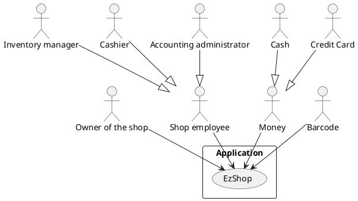
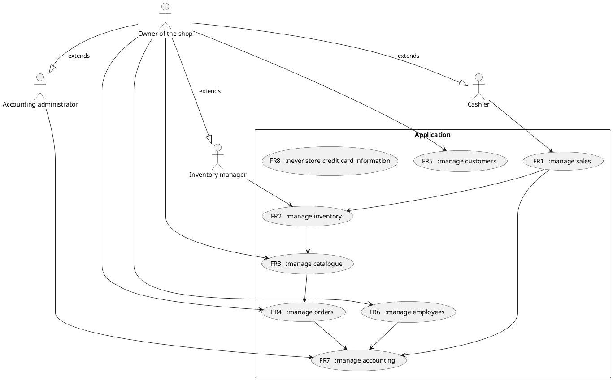
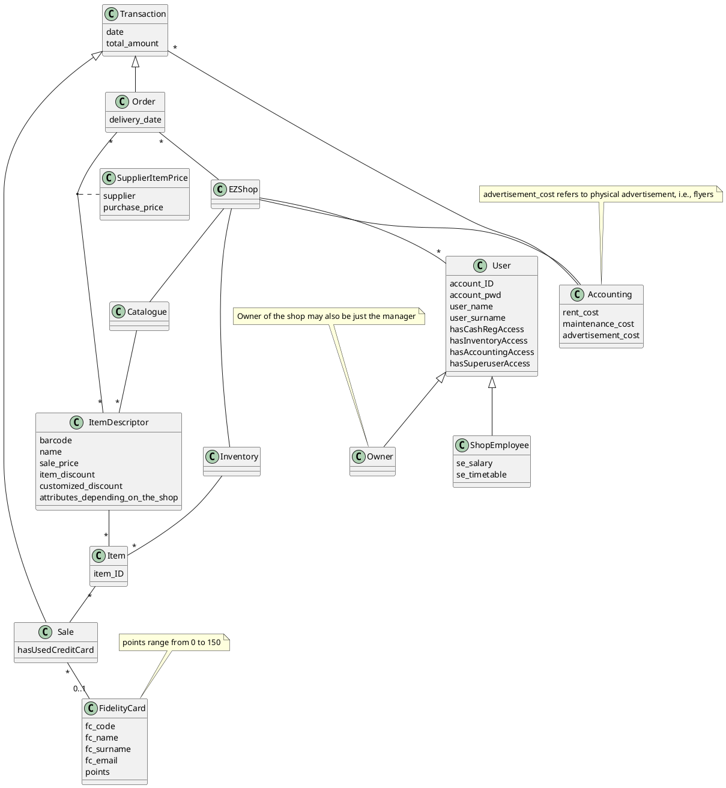
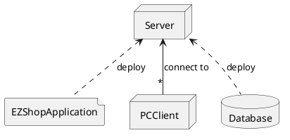

# Requirements Document 

Authors: Elia Fontana, Andrea Palomba, Leonardo Perugini, Francesco Sattolo

Date: 06/04/2021

Version: 1.0

# Contents

- [Requirements Document](#requirements-document)
- [Contents](#contents)
- [Essential description](#essential-description)
- [Stakeholders](#stakeholders)
- [Context Diagram and interfaces](#context-diagram-and-interfaces)
  - [Context Diagram](#context-diagram)
  - [Interfaces](#interfaces)
- [Stories and personas](#stories-and-personas)
- [Functional and non functional requirements](#functional-and-non-functional-requirements)
  - [Functional Requirements](#functional-requirements)
  - [Non Functional Requirements](#non-functional-requirements)
- [Use case diagram and use cases](#use-case-diagram-and-use-cases)
  - [Use case diagram](#use-case-diagram)
    - [Use case 1, FR1 customer buys items](#use-case-1-fr1-customer-buys-items)
        - [Scenario 1.1](#scenario-11)
        - [Scenario 1.2](#scenario-12)
    - [Use case 2, FR2.1, shop owner/inventory manager updates inventory](#use-case-2-fr21-shop-ownerinventory-manager-updates-inventory)
        - [Scenario 2.1](#scenario-21)
    - [Use case 3, FR2.2, shop owner/inventory manager searches for a item](#use-case-3-fr22-shop-ownerinventory-manager-searches-for-a-item)
    - [Use case 4, FR3.1 shop owner adds/removes item to/from catalogue](#use-case-4-fr31-shop-owner-addsremoves-item-tofrom-catalogue)
        - [Scenario 4.1](#scenario-41)
        - [Scenario 4.2](#scenario-42)
    - [Use case 5, FR3.3, shop owner applies a discount to a certain item](#use-case-5-fr33-shop-owner-applies-a-discount-to-a-certain-item)
    - [Use case 6, FR4.1, shop owner/inventory manager adds/remove item to/from order](#use-case-6-fr41-shop-ownerinventory-manager-addsremove-item-tofrom-order)
    - [Use case 7, FR4.2, shop owner/inventory manager places an order](#use-case-7-fr42-shop-ownerinventory-manager-places-an-order)
        - [Scenario 7.1](#scenario-71)
    - [Use case 8, FR5.1 Register fidelity card](#use-case-8-fr51-register-fidelity-card)
    - [Use case 9, FR5.2 Send customized promotions](#use-case-9-fr52-send-customized-promotions)
    - [Use case 10, FR6.1, shop owner adds/removes employee](#use-case-10-fr61-shop-owner-addsremoves-employee)
    - [Use case 11, FR6.2, shop owner changes employee's contract](#use-case-11-fr62-shop-owner-changes-employees-contract)
    - [Use case 12, FR7.1 update information about the shop](#use-case-12-fr71-update-information-about-the-shop)
    - [Use case 13, FR7.2 analize profits/losses](#use-case-13-fr72-analize-profitslosses)
- [Glossary](#glossary)
- [System Design](#system-design)
- [Deployment Diagram](#deployment-diagram)

# Essential description

Small shops require a simple application to support the owner or manager. A small shop (ex a food shop) occupies 50-200 square meters, sells 500-2000 different item types, has one or a few cash registers 
EZShop is a software application to:
* manage sales
* manage inventory
* manage customers
* support accounting

# Stakeholders

| Stakeholder name  |                                                               Description                                                               |
| ----------------- | :-------------------------------------------------------------------------------------------------------------------------------------: |
| Owner of the shop |                                               Manages all of the shop related activities                                                |
| Shop Employee     |                                          Cashier, Inventory manager, Accounting administrator                                           |
| Computer Engineer | Create and maintain the application and support the user of the application in case of problems (IT, database, security administrators) |
| Barcode           |                                                  Identifies each item of the inventory                                                  |
| Money             |                                               Used to pay for items (cash or credit card)                                               |

# Context Diagram and interfaces

## Context Diagram

## Interfaces

| Actor                    |     Logical Interface      |                           Physical Interface |
| ------------------------ | :------------------------: | -------------------------------------------: |
| Owner of the shop        |         admin view         |                  Screen keyboard mouse on PC |
| Cashier                  |        cashier view        |                  Screen keyboard mouse on PC |
| Inventory manager        |       inventory view       |                  Screen keyboard mouse on PC |
| Accounting administrator |      accounting view       |                  Screen keyboard mouse on PC |
| Barcode                  | file containing items code |     Barcode reader connected via USB to a PC |
| Cash                     |             x              |      Cash Register connected via USB to a PC |
| Credit Card              |             x              | Credit Card Reader connected via USB to a PC |

# Stories and personas

Owner:
- Tom is 49 years, he is a great seller and likes dealing with customers, but doesn't like tecnology a lot, so he wants an application that is simple to use.
His employees work for him since 10 years so he trust them in managing accounting and inventory; however, when there are no clients in the shop, sometimes he takes a look to the warehouse looking for missing items, because he detests when a client doesn't find what he is looking for. 
He also likes to have in stock all the latest releases so he updates them really frequently.

- Bill is 28 years, he bought the shop a few months ago. 
He is a precise person, so he wants to have control about all the aspects of the entire shop, in particular about the accounting part; he also would like to have statistic about sales in order to try to increase the shop profits.
He has 3 children, so he often can't be physically in the shop and he likes monitoring the situation at any time using his pc.

- Roberto is a man who used his life savings to buy a small shop. He needs to be able to manage all the aspects of the activity in a simple and centralized way. 
He is happy to do any of the roles required, but likes to focus more on managing the catalogue, the orders, and thinking about customers promotions.
For this reason he hired his friend Amanda, who usually works as a cashier, but can also manage the inventory when Roberto is not available.
He also need to keep track of incomes and expenses, but since he is not very good with them, he pays Paolo, a very good accounting adiministrator, to help him with this task. Since Roberto is not an expert, he prefers seeing graphs than spreadsheets.

Employee:
- Amanda loves to interact with customers, so she needs a fast application to manage sales quickly and don't make them wait. She is not very good with technology though, so she needs a simple application to manage the inventory without errors, even when Roberto is not around.

- Max is 23 years, he has not a lot experience about how to manage a shop inventory so he really likes the idea to use an application that helps him doing his job; he is also heedless so he is very happy to receive notification about the status of the inventory (when something is going to finish).
Fortunately also the supervisor may access to the inventory and control that everything is fine.

# Functional and non functional requirements

## Functional Requirements

| ID    |                    Description                     |
| ----- | :------------------------------------------------: |
| FR1   |                    manage sales                    |
| FR2   |                  manage inventory                  |
| FR2.1 |         Add/Remove items to/from inventory         |
| FR2.2 |           Search through items (ordered)           |
| FR2.3 | Send notification if item quantity under threshold |
| FR3   |                  manage catalogue                  |
| FR3.1 |         Add/Remove items to/from catalogue         |
| FR3.2 |           Search through items (ordered)           |
| FR3.3 |              Update item information               |
| FR4   |                   manage orders                    |
| FR4.1 |           Add/Remove items to/from order           |
| FR4.2 |          Send order and pay the supplier           |
| FR5   |                  manage customers                  |
| FR5.1 |              Register fidelity cards               |
| FR5.2 |    Send customized promotions (advertisements)     |
| FR6   |                  manage employees                  |
| FR6.1 |                Add/Remove Employee                 |
| FR6.2 |            Update Employee information             |
| FR7   |                 manage accounting                  |
| FR7.1 |         Update information about the shop          |
| FR7.2 |               Analize profits/losses               |
| FR8   |        never store credit card information         |

## Non Functional Requirements

\<Describe constraints on functional requirements>

| ID   | Type (efficiency, reliability, .. see iso 9126) |                                     Description                                     |   Refers to FR |
| ---- | :---------------------------------------------: | :---------------------------------------------------------------------------------: | -------------: |
| NFR1 |                    usability                    | The owner must learn to use all the functions within 30 minutes of training session |            all |
| NFR2 |                   efficiency                    |                   every function must have <0.1 ms response time                    | easy functions |
| NFR2 |                   efficiency                    |                     every function must have <1 s response time                     | hard functions |
| NFR3 |                 maintainability                 |                              add new functionalities?                               |            all |
| NFR4 |                   reliability                   |                      bugfixes must be completed within 1 week                       |            all |
| NFR4 |                  availability                   |                                     uptime 99%                                      |            all |
| NFR5 |                    security                     |            Restrict different views of the GUI only to authorized people            |            all |
| NFR6 |                     domain                      |               Possibility to change currency (euro,dollar), language                |                |

# Use case diagram and use cases

## Use case diagram

### Use case 1, FR1 customer buys items

| Actors Involved  |                                             shop owner, cashier, inventory manager                                              |
| ---------------- | :-----------------------------------------------------------------------------------------------------------------------------: |
| Precondition     |                                                        item in inventory                                                        |
| Post condition   |                              item sold, amount of items in inventory updated, transactions updated                              |
|                  |                                                                                                                                 |
| Nominal Scenario |                                                                                                                                 |
|                  |                        1. shop owner or cashier scans the barcode of the item using the barcode scanner                         |
|                  |                     2. The ID scanned by the barcode reader is used by the application to identify the item                     |
|                  |                                           3. Apply item discount to compute item cost                                           |
|                  |                                                     ...repeat for each item                                                     |
|                  |                                           4. Customer pays using cash or credit card                                            |
|                  | 5. Payment is successful (cashier receives enough money or reads on the credit card reader that the transaction was successful) |
|                  |                                               6. Cash register produces a receipt                                               |
|                  |                                             7. Update amount of items in inventory                                              |
|                  |        8. If one item amount drop under a certain threshold, send a notification to the shop owner or inventory manager         |
|                  |                                                   9. Update transactions list                                                   |
|                  |                                                                                                                                 |
| Variant1:        |                                                   customer with fidelity card                                                   |
| Variant2:        |                                                         payment failure                                                         |

##### Scenario 1.1 

| Scenario      | customer with fidelity card                                                                                   |
| ------------- | :------------------------------------------------------------------------------------------------------------ |
| Precondition  | item in inventory, customer already registered in the system                                                  |
| Postcondition | item sold, amount of items in inventory updated, gains updated, points updated                                |
| Step#         | Step description                                                                                              |
| 1             | Shop owner or cashier scans the barcode of the fidelity card using the barcode scanner                        |
| 2             | The ID scanned by the barcode reader is used by the application to identify the client                        |
| 3             | Shop owner or cashier scans the barcode of the item using the barcode scanner                                 |
| 4             | The ID scanned by the barcode reader is used by the application to identify the item                          |
| 5             | Apply item discount to compute item cost                                                                      |
| 6             | Apply customized discounts                                                                                    |
|               | ...repeat for each item                                                                                       |
| 7             | Customer pays using cash or credit card                                                                       |
| 8             | Payment is successful                                                                                         |
| 9             | Cash register produces a receipt                                                                              |
| 10            | Update amount of items in inventory                                                                           |
| 11            | If one item amount drop under a certain threshold, send a notification to the shop owner or inventory manager |
| 12            | Update transactions list                                                                                      |
| 13            | Update (add or subtract) customer's points                                                                    |
| 14            | Update customer's purchase history                                                                            |

##### Scenario 1.2 

| Scenario      | payment failure                                                                      |
| ------------- | :----------------------------------------------------------------------------------- |
| Precondition  | item in inventory                                                                    |
| Postcondition | Nothing is updated                                                                   |
| Step#         | Step description                                                                     |
| 1             | Shop owner or cashier scans the barcode of the item using the barcode scanner        |
| 2             | The ID scanned by the barcode reader is used by the application to identify the item |
| 3             | Apply item discount to compute item cost                                             |
|               | ...repeat for each item                                                              |
| 4             | Customer pays using cash or credit card                                              |
| 5             | Client doesn't have enough money or transaction fails                                |

### Use case 2, FR2.1, shop owner/inventory manager updates inventory

| Actors Involved  |            shop owner, inventory manager            |
| ---------------- | :-------------------------------------------------: |
| Precondition     | inventory in consistent state, item is in catalogue |
| Post condition   |             inventory updated correctly             |
|                  |                                                     |
| Nominal Scenario |                                                     |
|                  |       1. Actor searches through items (FR2.2)       |
|                  |                                                     |
| Variant          |                    order arrives                    |

##### Scenario 2.1 
| Scenario      | order arrives                             |
| ------------- | :---------------------------------------- |
| Precondition  | order arrives                             |
| Postcondition |                                           |
| Step#         | Step description                          |
| 1             | Actor searches through items (FR2.2)      |
| 2             | Actor adds/updates items in the inventory |

### Use case 3, FR2.2, shop owner/inventory manager searches for a item

| Actors Involved  |            shop owner, inventory manager            |
| ---------------- | :-------------------------------------------------: |
| Precondition     | inventory in consistent state, item is in catalogue |
| Post condition   |                                                     |
|                  |                                                     |
| Nominal Scenario |                                                     |
|                  |           1. Actor searches through items           |

### Use case 4, FR3.1 shop owner adds/removes item to/from catalogue
| Actors Involved  |               shop owner                |
| ---------------- | :-------------------------------------: |
| Precondition     | catalogue is updated and work propertly |
| Post condition   |            catalogue updated            |
|                  |                                         |
| Nominal Scenario |                                         |
|                  |                                         |
| Variant1         |             remove an item              |
| Variant2         |               add an item               |

##### Scenario 4.1

| Scenario      | shop owner remove an item from catalogue   |
| ------------- | :----------------------------------------- |
| Precondition  |                                            |
| Postcondition |                                            |
| Step#         |                                            |
| 1             | Shop owner searches through item           |
| 2             | Shop owner removes item from the catalogue |
| 3             | Shop owner removes item from the inventory |

##### Scenario 4.2

| Scenario      | shop owner add an item to catalogue         |
| ------------- | :------------------------------------------ |
| Precondition  |                                             |
| Postcondition |                                             |
| Step#         |                                             |
| 1             | Shop owner adds item to the catalogue       |
| 2             | Shop owner adds that item to the order(UC6) |

### Use case 5, FR3.3, shop owner applies a discount to a certain item                                          

| Actors Involved  |                              shop owner                              |
| ---------------- | :------------------------------------------------------------------: |
| Precondition     |                    catalogue in consistent state                     |
| Post condition   |                         catalogue is updated                         |
|                  |                                                                      |
| Nominal Scenario |                                                                      |
|                  |                 1. Shop owner searches through item                  |
|                  |            2. Shop owner decide/select discount to apply             |
|                  | 3. Shop owner decide/select the starting and ending date of discount |
|                  |                        4. discount is applied                        |

### Use case 6, FR4.1, shop owner/inventory manager adds/remove item to/from order    

| Actors Involved  |     shop owner, inventory manager     |
| ---------------- | :-----------------------------------: |
| Precondition     |                                       |
| Post condition   |          item added to order          |
|                  |                                       |
| Nominal Scenario |                                       |
|                  | 1. Actor searches through items (UC3) |
|                  |  2. Actor selects items and amounts   |
|                  |   3. Actor adds items to the order    |

### Use case 7, FR4.2, shop owner/inventory manager places an order     

| Actors Involved  |     shop owner, inventory manager     |
| ---------------- | :-----------------------------------: |
| Precondition     |    order size > minimum threshold     |
| Post condition   |              empty order              |
|                  |                                       |
| Nominal Scenario |                                       |
|                  | 1. Actor selects supplier to buy from |
|                  |  2. Order is placed to the supplier   |
|                  |          3. Payment success           |
|                  |            4. Empty order             |
|                  |                                       |
| Variant:         |            payment failure            |

##### Scenario 7.1

| Scenario      | payment failure                    |
| ------------- | :--------------------------------- |
| Precondition  |                                    |
| Postcondition | Nothing is updated                 |
| Step#         | Step description                   |
| 1             | Actor selects supplier to buy from |
| 2             | Order is placed to the supplier    |
| 3             | Payment failed                     |

### Use case 8, FR5.1 Register fidelity card

| Actors Involved  |                shop owner, cashier                |
| ---------------- | :-----------------------------------------------: |
| Precondition     |           Customer wants fidelity card            |
| Postcondition    | Customer receives fidelity card, database updated |
|                  |                                                   |
| Nominal scenario |       1. Insert customer data into database       |

### Use case 9, FR5.2 Send customized promotions

| Actors Involved  |                             shop owner                             |
| ---------------- | :----------------------------------------------------------------: |
| Precondition     |                     Send customized promotions                     |
| Post condition   |                    customized discounts updated                    |
|                  |                                                                    |
| Nominal Scenario |                                                                    |
|                  |    1. Application studies info about customer's past purchases     |
|                  |    2. Application selects n items constantly bought by customer    |
|                  | 3. Discounts associated with one or more of those items is updates |
|                  |  4. Application send email to customer notifying those discounts   |

### Use case 10, FR6.1, shop owner adds/removes employee     

| Actors Involved  |                           shop owner                           |
| ---------------- | :------------------------------------------------------------: |
| Precondition     |                                                                |
| Post condition   |            employee's information updated correctly            |
|                  |                                                                |
| Nominal Scenario |                                                                |
|                  |    1. Shop owner adds/removes employee to/from the database    |
|                  | 2. Shop owner adds/removes employee user account to the system |

### Use case 11, FR6.2, shop owner changes employee's contract     

| Actors Involved  |                         shop owner                         |
| ---------------- | :--------------------------------------------------------: |
| Precondition     |                                                            |
| Post condition   |          employee's information updated correctly          |
|                  |                                                            |
| Nominal Scenario |                                                            |
|                  | 1. Shop owner updates employee information in the database |

### Use case 12, FR7.1 update information about the shop

| Actors Involved  |                       shop owner                        |
| ---------------- | :-----------------------------------------------------: |
| Precondition     |                                                         |
| Post condition   |                      List updated                       |
|                  |                                                         |
| Nominal Scenario |                                                         |
|                  | 1. Owner adds/removes/update information about the shop |

### Use case 13, FR7.2 analize profits/losses

| Actors Involved  |              shop owner, accounting administrator               |
| ---------------- | :-------------------------------------------------------------: |
| Precondition     |   transaction list (incomes, expenses) in a consistent state    |
| Post condition   |                                                                 |
|                  |                                                                 |
| Nominal Scenario |                                                                 |
|                  |     1. List all incomes and expenses (grouped by category)      |
|                  | 2. Show statistics, reports and graphs about profits and losses |

# Glossary

# System Design

Barcode scanner, Cash Register and Credit Card Reader are existing physical products that we interact with just connecting them to our cash register PC.

# Deployment Diagram 

