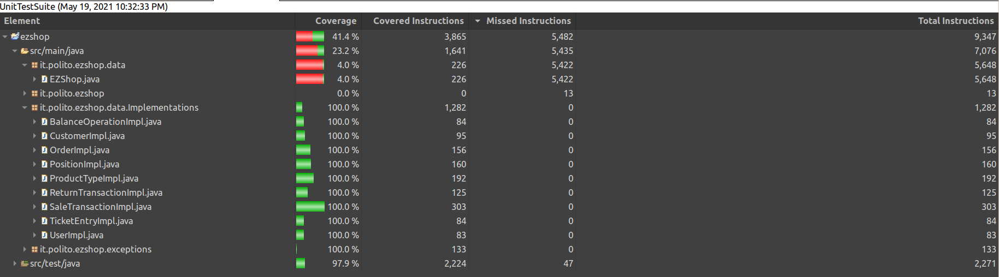

# Unit Testing Documentation

Authors: Elia Fontana, Andrea Palomba, Leonardo Perugini, Francesco Sattolo

Date: 19/05/2021

Version: 1.0

# Contents

- [Unit Testing Documentation](#unit-testing-documentation)
- [Contents](#contents)
- [Black Box Unit Tests](#black-box-unit-tests)
    - [Class UserImpl](#class-userimpl)
      - [constructor](#constructor)
      - [setId](#setid)
      - [setUsername](#setusername)
      - [setPassword](#setpassword)
      - [setRole](#setrole)
    - [Class CustomerImpl](#class-customerimpl)
      - [constructor](#constructor-1)
      - [setId](#setid-1)
      - [setUsername](#setusername-1)
      - [setCustomerCard](#setcustomercard)
      - [setPoints](#setpoints)
    - [Class ProductTypeImpl](#class-producttypeimpl)
      - [constructor](#constructor-2)
      - [setId](#setid-2)
      - [setProductDescription](#setproductdescription)
      - [setBarCode](#setbarcode)
      - [setPricePerUnit](#setpriceperunit)
      - [setNote](#setnote)
      - [setLocation](#setlocation)
      - [setQuantity](#setquantity)
      - [setDiscountRate](#setdiscountrate)
    - [Class TicketEntryImpl](#class-ticketentryimpl)
      - [constructor](#constructor-3)
      - [setProductDescription](#setproductdescription-1)
      - [setBarCode](#setbarcode-1)
      - [setPricePerUnit](#setpriceperunit-1)
      - [setDiscountRate](#setdiscountrate-1)
      - [setAmount](#setamount)
    - [Class PositionImpl](#class-positionimpl)
      - [constructor](#constructor-4)
      - [setPosition](#setposition)
    - [**Class *SaleTransactionImpl*](#class-saletransactionimpl)
      - [constructor](#constructor-5)
      - [setTicketNumber](#setticketnumber)
      - [setPrice](#setprice)
      - [setDiscountRate](#setdiscountrate-2)
      - [setEntries](#setentries)
      - [setBalanceOperation](#setbalanceoperation)
      - [removeAmountFromEntry](#removeamountfromentry)
      - [setDiscountRateToProduct](#setdiscountratetoproduct)
      - [upsertEntry](#upsertentry)
    - [**Class *ReturnTransactionImpl* **](#class-returntransactionimpl-)
      - [constructor](#constructor-6)
      - [setReturnId](#setreturnid)
      - [setProductId](#setproductid)
      - [setProductCode](#setproductcode)
      - [setPricePerUnit](#setpriceperunit-2)
      - [setDiscountRate](#setdiscountrate-3)
      - [setAmount](#setamount-1)
      - [setPrice](#setprice-1)
      - [setSaleTransaction](#setsaletransaction)
    - [Class *BalanceOperationImpl*](#class-balanceoperationimpl)
      - [constructor](#constructor-7)
      - [setBalanceId](#setbalanceid)
      - [setDate](#setdate)
      - [setMoney](#setmoney)
      - [setType](#settype)
    - [Class *OrderImpl*](#class-orderimpl)
      - [constructor](#constructor-8)
      - [setBalanceId](#setbalanceid-1)
      - [setOrderId](#setorderid)
      - [setPricePerUnit](#setpriceperunit-3)
      - [setQuantity](#setquantity-1)
      - [setProductCode](#setproductcode-1)
      - [setStatus](#setstatus)
    - [Class EZShop](#class-ezshop)
      - [dbAccess](#dbaccess)
      - [dbClose](#dbclose)
      - [isStringOnlyAlphabet](#isstringonlyalphabet)
      - [isStringOnlyNumbers](#isstringonlynumbers)
      - [isBarcodeValid](#isbarcodevalid)
      - [checkLuhn](#checkluhn)
- [White Box Unit Tests](#white-box-unit-tests)
    - [Test cases definition](#test-cases-definition)
    - [Code coverage report](#code-coverage-report)
    - [Loop coverage analysis](#loop-coverage-analysis)

# Black Box Unit Tests

    <Define here criteria, predicates and the combination of predicates for each function of each class.
    Define test cases to cover all equivalence classes and boundary conditions.
    In the table, report the description of the black box test case and (traceability) the correspondence with the JUnit test case writing the 
    class and method name that contains the test case>
    <JUnit test classes must be in src/test/java/it/polito/ezshop   You find here, and you can use,  class TestEzShops.java that is executed  
    to start tests
    >

### Class UserImpl
#### constructor
**Criteria for method *constructor*:**

 - Validity of the Integer *id*
 - Validity of the String *username*
 - Validity of the String *password*
 - Validity of the String *role*

**Predicates for method *constructor*:**

| Criteria                          | Predicate |
| --------------------------------- | --------- |
| Validity of the Integer *id*      | Valid     |
| Validity of the String *username* | Valid     |
| Validity of the String *password* | Valid     |
| Validity of the String *role*     | Valid     |

**Boundaries**:

| Criteria | Boundary values |
| -------- | --------------- |

**Combination of predicates**:

| Validity of the Integer *id* | Validity of the String *username* | Validity of the String *password* | Validity of the String *role* | Valid / Invalid | Description of the test case                          | JUnit test case UserClassTest |
| ---------------------------- | --------------------------------- | --------------------------------- | ----------------------------- | --------------- | ----------------------------------------------------- | ----------------------------- |
| Valid                        | Valid                             | Valid                             | Valid                         | Valid           | user = new UserImpl(10,"Marco","xxx","Adminitrator"); | testCase1                     |

#### setId
**Criteria for method *setId*:**

 - Validity of the Integer *id*

**Predicates for method *setId*:**

| Criteria                     | Predicate |
| ---------------------------- | --------- |
| Validity of the Integer *id* | Valid     |

**Boundaries**:

| Criteria | Boundary values |
| -------- | --------------- |

**Combination of predicates**:

| Validity of the Integer *id* | Valid / Invalid | Description of the test case | JUnit test case UserClassTest |
| ---------------------------- | --------------- | ---------------------------- | ----------------------------- |
| Valid                        | Valid           | user.setId(25);              | testCase2                     |

#### setUsername
**Criteria for method *setUsername*:**

 - Validity of the String *username*

**Predicates for method *setUsername*:**

| Criteria                          | Predicate |
| --------------------------------- | --------- |
| Validity of the String *username* | Valid     |

**Boundaries**:

| Criteria | Boundary values |
| -------- | --------------- |

**Combination of predicates**:

| Validity of the String *username* | Valid / Invalid | Description of the test case | JUnit test case UserClassTest |
| --------------------------------- | --------------- | ---------------------------- | ----------------------------- |
| Valid                             | Valid           | user.setUsername("Pippo");   | testCase3                     |

#### setPassword
**Criteria for method *setPassword*:**

 - Validity of the String *password*

**Predicates for method *setPassword*:**

| Criteria                          | Predicate |
| --------------------------------- | --------- |
| Validity of the String *password* | Valid     |

**Boundaries**:

| Criteria | Boundary values |
| -------- | --------------- |

**Combination of predicates**:

| Validity of the String *password* | Valid / Invalid | Description of the test case | JUnit test case UserClassTest |
| --------------------------------- | --------------- | ---------------------------- | ----------------------------- |
| Valid                             | Valid           | user.setPassword("pass");    | testCase4                     |

#### setRole
**Criteria for method *setRole*:**

 - Validity of the String *role*

**Predicates for method *setRole*:**

| Criteria                      | Predicate |
| ----------------------------- | --------- |
| Validity of the String *role* | Valid     |

**Boundaries**:

| Criteria | Boundary values |
| -------- | --------------- |

**Combination of predicates**:

| Validity of the String *role* | Valid / Invalid | Description of the test case | JUnit test case UserClassTest |
| ----------------------------- | --------------- | ---------------------------- | ----------------------------- |
| Valid                         | Valid           | user.setRole("Cashier");     | testCase5                     |

### Class CustomerImpl 
#### constructor
**Criteria for method *constructor*:**

 - Validity of the Integer *id*
 - Validity of the String *name*
 - Validity of the String *card*
 - Validity of the Integer *points*

**Predicates for method *constructor*:**

| Criteria                         | Predicate |
| -------------------------------- | --------- |
| Validity of the Integer *id*     | Valid     |
| Validity of the String *name*    | Valid     |
| Validity of the String *card*    | Valid     |
| Validity of the Integer *points* | Valid     |

**Boundaries**:

| Criteria | Boundary values |
| -------- | --------------- |

**Combination of predicates**:

| Validity of the Integer *id* | Validity of the String *name* | Validity of the String *card* | Validity of the Integer *points* | Valid / Invalid | Description of the test case                             | JUnit test case CustomerClassTest |
| ---------------------------- | ----------------------------- | ----------------------------- | -------------------------------- | --------------- | -------------------------------------------------------- | --------------------------------- |
| Valid                        | Valid                         | Valid                         | Valid                            | Valid           | customer = new CustomerImpl(2,"Giulia","1124432525",15); | testCase1                         |

#### setId
**Criteria for method *setId*:**

 - Validity of the Integer *id*

**Predicates for method *setId*:**

| Criteria                     | Predicate |
| ---------------------------- | --------- |
| Validity of the Integer *id* | Valid     |

**Boundaries**:

| Criteria | Boundary values |
| -------- | --------------- |

**Combination of predicates**:

| Validity of the Integer *id* | Valid / Invalid | Description of the test case | JUnit test case CustomerClassTest |
| ---------------------------- | --------------- | ---------------------------- | --------------------------------- |
| Valid                        | Valid           | customer.setId(1);           | testCase2                         |

#### setUsername
**Criteria for method *setCustomerName*:**

 - Validity of the String *name*

**Predicates for method *setCustomerName*:**

| Criteria                      | Predicate |
| ----------------------------- | --------- |
| Validity of the String *name* | Valid     |

**Boundaries**:

| Criteria | Boundary values |
| -------- | --------------- |

**Combination of predicates**:

| Validity of the String *name* | Valid / Invalid | Description of the test case        | JUnit test case CustomerClassTest |
| ----------------------------- | --------------- | ----------------------------------- | --------------------------------- |
| Valid                         | Valid           | customer.setCustomerName("Chiara"); | testCase3                         |

#### setCustomerCard
**Criteria for method *setCustomerCard*:**

 - Validity of the String *card*

**Predicates for method *setCustomerCard*:**

| Criteria                      | Predicate |
| ----------------------------- | --------- |
| Validity of the String *card* | Valid     |

**Boundaries**:

| Criteria | Boundary values |
| -------- | --------------- |

**Combination of predicates**:

| Validity of the String *card* | Valid / Invalid | Description of the test case            | JUnit test case CustomerClassTest |
| ----------------------------- | --------------- | --------------------------------------- | --------------------------------- |
| Valid                         | Valid           | customer.setCustomerCard("1234567890"); | testCase4                         |

#### setPoints
**Criteria for method *setPoints*:**

 - Validity of the Integer *points*

**Predicates for method *setPoints*:**

| Criteria                         | Predicate |
| -------------------------------- | --------- |
| Validity of the Integer *points* | Valid     |

**Boundaries**:

| Criteria | Boundary values |
| -------- | --------------- |

**Combination of predicates**:

| Validity of the Integer *points* | Valid / Invalid | Description of the test case | JUnit test case CustomerClassTest |
| -------------------------------- | --------------- | ---------------------------- | --------------------------------- |
| Valid                            | Valid           | customer.setPoints(10);      | testCase5                         |

### Class ProductTypeImpl
#### constructor
**Criteria for method *constructor*:**

 - Validity of the String *note*
 - Validity of the String *description*
 - Validity of the String *barcode*
 - Validity of the Double *pricePerUnit*

**Predicates for method *constructor*:**

| Criteria                              | Predicate |
| ------------------------------------- | --------- |
| Validity of the String *note*         | Valid     |
| Validity of the String *description*  | Valid     |
| Validity of the String *barcode*      | Valid     |
| Validity of the Double *pricePerUnit* | Valid     |

**Boundaries**:

| Criteria | Boundary values |
| -------- | --------------- |

**Combination of predicates**:

| Validity of the String *note* | Validity of the String *description* | Validity of the String *barcode* | Validity of the Double *pricePerUnit* | Valid / Invalid | Description of the test case                                              | JUnit test case ProductTypeClassTest |
| ----------------------------- | ------------------------------------ | -------------------------------- | ------------------------------------- | --------------- | ------------------------------------------------------------------------- | ------------------------------------ |
| Valid                         | Valid                                | Valid                            | Valid                                 | Valid           | product = new ProductTypeImpl("note","description","12637482635892",2.5); | testCase1                            |

#### setId
**Criteria for method *setId*:**

 - Validity of the Integer *id*

**Predicates for method *setId*:**

| Criteria                     | Predicate |
| ---------------------------- | --------- |
| Validity of the Integer *id* | Valid     |

**Boundaries**:

| Criteria | Boundary values |
| -------- | --------------- |

**Combination of predicates**:

| Validity of the Integer *id* | Valid / Invalid | Description of the test case | JUnit test case ProductTypeClassTest |
| ---------------------------- | --------------- | ---------------------------- | ------------------------------------ |
| Valid                        | Valid           | product.setId(1);            | testCase2                            |

#### setProductDescription
**Criteria for method *setProductDescription*:**

 - Validity of the String *description*

**Predicates for method *setProductDescription*:**

| Criteria                             | Predicate |
| ------------------------------------ | --------- |
| Validity of the String *description* | Valid     |

**Boundaries**:

| Criteria | Boundary values |
| -------- | --------------- |

**Combination of predicates**:

| Validity of the String *description* | Valid / Invalid | Description of the test case               | JUnit test case ProductTypeClassTest |
| ------------------------------------ | --------------- | ------------------------------------------ | ------------------------------------ |
| Valid                                | Valid           | product.setProductDescription("new desc"); | testCase3                            |

#### setBarCode
**Criteria for method *setBarCode*:**

 - Validity of the String *barCode*

**Predicates for method *setBarCode*:**

| Criteria                         | Predicate |
| -------------------------------- | --------- |
| Validity of the String *barCode* | Valid     |

**Boundaries**:

| Criteria | Boundary values |
| -------- | --------------- |

**Combination of predicates**:

| Validity of the String *varCode* | Valid / Invalid | Description of the test case         | JUnit test case ProductTypeClassTest |
| -------------------------------- | --------------- | ------------------------------------ | ------------------------------------ |
| Valid                            | Valid           | product.setBarCode("6253478956438"); | testCase4                            |

#### setPricePerUnit
**Criteria for method *setPricePerUnit*:**

 - Validity of the Double *pricePerUnit*

**Predicates for method *setPricePerUnit*:**

| Criteria                              | Predicate |
| ------------------------------------- | --------- |
| Validity of the Double *pricePerUnit* | Valid     |

**Boundaries**:

| Criteria | Boundary values |
| -------- | --------------- |

**Combination of predicates**:

| Validity of the Double *pricePerUnit* | Valid / Invalid | Description of the test case   | JUnit test case ProductTypeClassTest |
| ------------------------------------- | --------------- | ------------------------------ | ------------------------------------ |
| Valid                                 | Valid           | product.setPricePerUnit(25.0); | testCase5                            |

#### setNote
**Criteria for method *setNote*:**

 - Validity of the String *note*

**Predicates for method *setNote*:**

| Criteria                      | Predicate |
| ----------------------------- | --------- |
| Validity of the Double *note* | Valid     |

**Boundaries**:

| Criteria | Boundary values |
| -------- | --------------- |

**Combination of predicates**:

| Validity of the String *note* | Valid / Invalid | Description of the test case | JUnit test case ProductTypeClassTest |
| ----------------------------- | --------------- | ---------------------------- | ------------------------------------ |
| Valid                         | Valid           | product.setNote("new note"); | testCase6                            |

#### setLocation
**Criteria for method *setLocation*:**

 - Validity of the String *location*

**Predicates for method *setLocation*:**

| Criteria                          | Predicate |
| --------------------------------- | --------- |
| Validity of the String *location* | Valid     |

**Boundaries**:

| Criteria | Boundary values |
| -------- | --------------- |

**Combination of predicates**:

| Validity of the String *location* | Valid / Invalid | Description of the test case      | JUnit test case ProductTypeClassTest |
| --------------------------------- | --------------- | --------------------------------- | ------------------------------------ |
| Valid                             | Valid           | product.setLocation("3 aisle 3"); | testCase7                            |

#### setQuantity
**Criteria for method *setQuantity*:**

 - Validity of the Integer *quantity*

**Predicates for method *setQuantity*:**

| Criteria                           | Predicate |
| ---------------------------------- | --------- |
| Validity of the Integer *quantity* | Valid     |

**Boundaries**:

| Criteria | Boundary values |
| -------- | --------------- |

**Combination of predicates**:

| Validity of the Integer *quantity* | Valid / Invalid | Description of the test case | JUnit test case ProductTypeClassTest |
| ---------------------------------- | --------------- | ---------------------------- | ------------------------------------ |
| Valid                              | Valid           | product.setQuantity(4);      | testCase8                            |

#### setDiscountRate
**Criteria for method *setDiscountRate*:**

 - Validity of the Integer *discountRate*

**Predicates for method *setDiscountRate*:**

| Criteria                               | Predicate |
| -------------------------------------- | --------- |
| Validity of the Integer *discountRate* | Valid     |

**Boundaries**:

| Criteria | Boundary values |
| -------- | --------------- |

**Combination of predicates**:

| Validity of the Integer *discountRate* | Valid / Invalid | Description of the test case                                                       | JUnit test case ProductTypeClassTest |
| -------------------------------------- | --------------- | ---------------------------------------------------------------------------------- | ------------------------------------ |
| Valid                                  | Valid           | ProductTypeImpl product2 = new ProductTypeImpl();  product2.setDiscountRate(20.0); | testCase9                            |

### Class TicketEntryImpl

#### constructor
**Criteria for method *constructor*:**

 - Validity of the String *barcode*
 - Validity of the String *description*
 - Validity of the Double *pricePerUnit*
 - Validity of the Double *discountRate*
 - Validity of the Integer *amount*

**Predicates for method *constructor*:**

| Criteria                              | Predicate |
| ------------------------------------- | --------- |
| Validity of the String *barcode*      | Valid     |
| Validity of the String *description*  | Valid     |
| Validity of the Double *pricePerUnit* | Valid     |
| Validity of the Double *discountRate* | Valid     |
| Validity of the Integer *amount*      | Valid     |

**Boundaries**:

| Criteria | Boundary values |
| -------- | --------------- |

**Combination of predicates**:

| Validity of the String *barcode* | Validity of the String *description* | Validity of the Double *pricePerUnit* | Validity of the Double *discountRate* | Validity of the Integer *amount* | Valid / Invalid | Description of the test case                                                            | JUnit test case TicketEntryClassTest |
| -------------------------------- | ------------------------------------ | ------------------------------------- | ------------------------------------- | -------------------------------- | --------------- | --------------------------------------------------------------------------------------- | ------------------------------------ |
| Valid                            | Valid                                | Valid                                 | Valid                                 | Valid                            | Valid           | product = product = new TicketEntryImpl("12637482635892", "description", 2.0, 0.0, 10); | testCase1                            |

#### setProductDescription
**Criteria for method *setProductDescription*:**

 - Validity of the String *description*

**Predicates for method *setProductDescription*:**

| Criteria                             | Predicate |
| ------------------------------------ | --------- |
| Validity of the String *description* | Valid     |

**Boundaries**:

| Criteria | Boundary values |
| -------- | --------------- |

**Combination of predicates**:

| Validity of the String *description* | Valid / Invalid | Description of the test case               | JUnit test case TicketEntryClassTest |
| ------------------------------------ | --------------- | ------------------------------------------ | ------------------------------------ |
| Valid                                | Valid           | product.setProductDescription("new desc"); | testCase2                            |

#### setBarCode
**Criteria for method *setBarCode*:**

 - Validity of the String *barCode*

**Predicates for method *setBarCode*:**

| Criteria                         | Predicate |
| -------------------------------- | --------- |
| Validity of the String *barCode* | Valid     |

**Boundaries**:

| Criteria | Boundary values |
| -------- | --------------- |

**Combination of predicates**:

| Validity of the String *varCode* | Valid / Invalid | Description of the test case         | JUnit test case TicketEntryClassTest |
| -------------------------------- | --------------- | ------------------------------------ | ------------------------------------ |
| Valid                            | Valid           | product.setBarCode("6253478956438"); | testCase3                            |

#### setPricePerUnit
**Criteria for method *setPricePerUnit*:**

 - Validity of the Double *pricePerUnit*

**Predicates for method *setPricePerUnit*:**

| Criteria                              | Predicate |
| ------------------------------------- | --------- |
| Validity of the Double *pricePerUnit* | Valid     |

**Boundaries**:

| Criteria | Boundary values |
| -------- | --------------- |

**Combination of predicates**:

| Validity of the Double *pricePerUnit* | Valid / Invalid | Description of the test case   | JUnit test case TicketEntryClassTest |
| ------------------------------------- | --------------- | ------------------------------ | ------------------------------------ |
| Valid                                 | Valid           | product.setPricePerUnit(25.0); | testCase4                            |

#### setDiscountRate
**Criteria for method *setDiscountRate*:**

 - Validity of the Integer *discountRate*

**Predicates for method *setDiscountRate*:**

| Criteria                               | Predicate |
| -------------------------------------- | --------- |
| Validity of the Integer *discountRate* | Valid     |

**Boundaries**:

| Criteria | Boundary values |
| -------- | --------------- |

**Combination of predicates**:

| Validity of the Integer *discountRate* | Valid / Invalid | Description of the test case                                                       | JUnit test case TicketEntryClassTest |
| -------------------------------------- | --------------- | ---------------------------------------------------------------------------------- | ------------------------------------ |
| Valid                                  | Valid           | ProductTypeImpl product2 = new ProductTypeImpl();  product2.setDiscountRate(20.0); | testCase5                            |

#### setAmount
**Criteria for method *setAmount*:**

 - Validity of the Integer *amount*

**Predicates for method *setAmount*:**

| Criteria                         | Predicate |
| -------------------------------- | --------- |
| Validity of the Integer *amount* | Valid     |

**Boundaries**:

| Criteria | Boundary values |
| -------- | --------------- |

**Combination of predicates**:

| Validity of the Integer *amount* | Valid / Invalid | Description of the test case | JUnit test case TicketEntryClassTest |
| -------------------------------- | --------------- | ---------------------------- | ------------------------------------ |
| Valid                            | Valid           | product.setAmount(15);       | testCase6                            |

### Class PositionImpl

#### constructor
*Criteria for method *constructor*:**

 - Validity of the String *position*

**Predicates for method *constructor*:**

| Criteria                                   | Predicate |
| ------------------------------------------ | --------- |
| Length of the String *position.split(" ")* | = 3       |
|                                            | != 3      |

**Boundaries**:

| Criteria | Boundary values |
| -------- | --------------- |

**Combination of predicates**:

| Length of the String *position.split(" ")* | Valid / Invalid | Description of the test case                            | JUnit test case TicketEntryClassTest |
| ------------------------------------------ | --------------- | ------------------------------------------------------- | ------------------------------------ |
| = 3                                        | Valid           | PositionImpl position4 = new PositionImpl("3 aisle 4"); | testCase1                            |
| != 3                                       | Valid           | PositionImpl position3 = new PositionImpl("corridor");  | testCase2                            |

#### setPosition
*Criteria for method *setPosition*:**

 - Validity of the String *position*

**Predicates for method *setPosition*:**

| Criteria                                   | Predicate |
| ------------------------------------------ | --------- |
| Length of the String *position.split(" ")* | = 3       |
|                                            | != 3      |

**Boundaries**:

| Criteria | Boundary values |
| -------- | --------------- |

**Combination of predicates**:

| Length of the String *position.split(" ")* | Valid / Invalid | Description of the test case                                                      | JUnit test case TicketEntryClassTest |
| ------------------------------------------ | --------------- | --------------------------------------------------------------------------------- | ------------------------------------ |
| = 3                                        | Valid           | PositionImpl position = new PositionImpl(); position.setPosition("2 corridor 3"); | testCase3                            |
| != 3                                       | Valid           | PositionImpl position = new PositionImpl(); position.setPosition("");             | testCase4                            |

### **Class *SaleTransactionImpl*
#### constructor
**Criteria for method *constructor*:**

 - Validity of the Integer *ticketNumber*

**Predicates for method *constructor*:**

| Criteria                               | Predicate |
| -------------------------------------- | --------- |
| Validity of the Integer *ticketNumber* | Valid     |

**Boundaries**:

| Criteria | Boundary values |
| -------- | --------------- |

**Combination of predicates**:

| Validity of the Integer *ticketNumber* | Valid / Invalid | Description of the test case                  | JUnit test case ProductTypeClassTest |
| -------------------------------------- | --------------- | --------------------------------------------- | ------------------------------------ |
| Valid                                  | Valid           | saleTransaction = new SaleTransactionImpl(1); | testCase1                            |

#### setTicketNumber
**Criteria for method *setTicketNumber*:**

 - Validity of the Integer *ticketNumber*

**Predicates for method *setTicketNumber*:**

| Criteria                               | Predicate |
| -------------------------------------- | --------- |
| Validity of the Integer *ticketNumber* | Valid     |

**Boundaries**:

| Criteria | Boundary values |
| -------- | --------------- |

**Combination of predicates**:

| Validity of the Integer *ticketNumber* | Valid / Invalid | Description of the test case        | JUnit test case ProductTypeClassTest |
| -------------------------------------- | --------------- | ----------------------------------- | ------------------------------------ |
| Valid                                  | Valid           | saleTransaction.setTicketNumber(2); | testCase1                            |

#### setPrice
**Criteria for method *setPrice*:**

 - Validity of the double *price*

**Predicates for method *setPrice*:**

| Criteria                       | Predicate |
| ------------------------------ | --------- |
| Validity of the double *price* | Valid     |

**Boundaries**:

| Criteria | Boundary values |
| -------- | --------------- |

**Combination of predicates**:

| Validity of the double *price* | Valid / Invalid | Description of the test case   | JUnit test case ProductTypeClassTest |
| ------------------------------ | --------------- | ------------------------------ | ------------------------------------ |
| Valid                          | Valid           | saleTransaction.setPrice(3.0); | testCase1                            |

#### setDiscountRate
**Criteria for method *setDiscountRate*:**

 - Validity of the double *discountRate*

**Predicates for method *setDiscountRate*:**

| Criteria                              | Predicate |
| ------------------------------------- | --------- |
| Validity of the double *discountRate* | Valid     |

**Boundaries**:

| Criteria | Boundary values |
| -------- | --------------- |

**Combination of predicates**:

| Validity of the double *discountRate* | Valid / Invalid | Description of the test case          | JUnit test case ProductTypeClassTest |
| ------------------------------------- | --------------- | ------------------------------------- | ------------------------------------ |
| Valid                                 | Valid           | saleTransaction.setDiscountRate(0.4); | testCase1                            |

#### setEntries
**Criteria for method *setEntries*:**

 - Validity of the LinkedList\<TicketEntry> entries

**Predicates for method *setEntries*:**

| Criteria                                         | Predicate |
| ------------------------------------------------ | --------- |
| Validity of the LinkedList\<TicketEntry> entries | Valid     |

**Boundaries**:

| Criteria | Boundary values |
| -------- | --------------- |

**Combination of predicates**:

| Validity of the LinkedList\<TicketEntry> entries | Valid / Invalid | Description of the test case                                                                            | JUnit test case ProductTypeClassTest |
| ------------------------------------------------ | --------------- | ------------------------------------------------------------------------------------------------------- | ------------------------------------ |
| Valid                                            | Valid           | LinkedList\<TicketEntry> entries = new LinkedList\<TicketEntry>(); saleTransaction.setEntries(entries); | testCase1                            |

#### setBalanceOperation
**Criteria for method *setBalanceOperation*:**

 - Validity of the BalanceOperation balanceOperation

**Predicates for method *setBalanceOperation*:**

| Criteria                                          | Predicate |
| ------------------------------------------------- | --------- |
| Validity of the BalanceOperation balanceOperation | Valid     |

**Boundaries**:

| Criteria | Boundary values |
| -------- | --------------- |

**Combination of predicates**:

| Validity of the BalanceOperation balanceOperation | Valid / Invalid | Description of the test case                                                                     | JUnit test case ProductTypeClassTest |
| ------------------------------------------------- | --------------- | ------------------------------------------------------------------------------------------------ | ------------------------------------ |
| Valid                                             | Valid           | BalanceOperation balanceOperation = null; saleTransaction.setBalanceOperation(balanceOperation); | testCase1                            |

#### removeAmountFromEntry
**Criteria for method *removeAmountFromEntry*:**

 - Validity of the String *barcode*
 - Validity of the Integer *amountToRemove*
 - *amountToRemove*

**Predicates for method *removeAmountFromEntry*:**

| Criteria                                 | Predicate                |
| ---------------------------------------- | ------------------------ |
| Validity of the String *barcode*         | Valid                    |
|                                          | Invalid                  |
| Validity of the Integer *amountToRemove* | Valid                    |
| *amountToRemove*                         | (0, previousAmount)      |
|                                          | previousAmount           |
|                                          | (previousAmount, maxint) |

**Boundaries**:

| Criteria         | Boundary values |
| ---------------- | --------------- |
| *amountToRemove* | previousAmount  |

**Combination of predicates**:

| Validity of the String *barcode* | Validity of the Integer *amountToRemove* | *amountToRemove*          | Valid / Invalid | Description of the test case                                                                                                                                                                                                                          | JUnit test case TicketEntryClassTest |
| -------------------------------- | ---------------------------------------- | ------------------------- | --------------- | ----------------------------------------------------------------------------------------------------------------------------------------------------------------------------------------------------------------------------------------------------- | ------------------------------------ |
| Valid                            | Valid                                    | (-maxint, previousAmount) | Valid(true)     | LinkedList\<TicketEntry> entries = new LinkedList\<TicketEntry>(); entries.add(new TicketEntryImpl("12637482635892", "description", 2.0, 0.1, 10)); saleTransaction.setEntries(entries); saleTransaction.removeAmountFromEntry("12637482635892", 1);  | testCase2                            |
| Valid                            | Valid                                    | previousAmount            | Valid(true)     | LinkedList/<TicketEntry> entries = new LinkedList/<TicketEntry>(); entries.add(new TicketEntryImpl("12637482635892", "description", 2.0, 0.1, 10)); saleTransaction.setEntries(entries); saleTransaction.removeAmountFromEntry("12637482635892", 10); | testCase3                            |
| Valid                            | Valid                                    | (previousAmount, maxint)  | Valid(false)    | LinkedList\<TicketEntry> entries = new LinkedList\<TicketEntry>(); entries.add(new TicketEntryImpl("12637482635892", "description", 2.0, 0.1, 10)); saleTransaction.setEntries(entries); saleTransaction.removeAmountFromEntry("12637482635892", 11); | testCase4                            |
| Invalid                          | *                                        | *                         | Valid(false)    | LinkedList\<TicketEntry> entries = new LinkedList\<TicketEntry>(); entries.add(new TicketEntryImpl("12637482635892", "description", 2.0, 0.1, 10)); saleTransaction.setEntries(entries); saleTransaction.removeAmountFromEntry("22637482635892", 4);  | testCase5                            |

#### setDiscountRateToProduct
**Criteria for method *setDiscountRateToProduct*:**

 - Validity of the String *barcode*
 - Validity of the double *discountRate*

**Predicates for method *setDiscountRateToProduct*:**

| Criteria                              | Predicate |
| ------------------------------------- | --------- |
| Validity of the String *barcode*      | Valid     |
|                                       | Invalid   |
| Validity of the double *discountRate* | Valid     |

**Boundaries**:

| Criteria | Boundary values |
| -------- | --------------- |

**Combination of predicates**:

| Validity of the String *barcode* | Validity of the double *discountRate* | Valid / Invalid | Description of the test case                                                                                                                                                                                                                              | JUnit test case TicketEntryClassTest |
| -------------------------------- | ------------------------------------- | --------------- | --------------------------------------------------------------------------------------------------------------------------------------------------------------------------------------------------------------------------------------------------------- | ------------------------------------ |
| Valid                            | Valid                                 | Valid           | LinkedList\<TicketEntry> entries = new LinkedList/<TicketEntry>(); entries.add(new TicketEntryImpl("12637482635892", "description", 2.0, 0.1, 10)); saleTransaction.setEntries(entries); saleTransaction.setDiscountRateToProduct("12637482635892", 0.2); | testCase7                            |
| Invalid                          | *                                     | Valid(false)    | LinkedList\<TicketEntry> entries = new LinkedList/<TicketEntry>(); entries.add(new TicketEntryImpl("12637482635892", "description", 2.0, 0.1, 10)); saleTransaction.setEntries(entries); saleTransaction.setDiscountRateToProduct("22637482635892", 0.2); | testCase8                            |

#### upsertEntry
**Criteria for method *upsertEntry*:**

 - Validity of the ProductType *productType*
 - Validity of the int *amount*

**Predicates for method *upsertEntry*:**

| Criteria                                  | Predicate |
| ----------------------------------------- | --------- |
| Validity of the ProductType *productType* | Valid     |
| Validity of the int *amount*              | Valid     |

**Boundaries**:

| Criteria | Boundary values |
| -------- | --------------- |

**Combination of predicates**:

| Validity of the ProductType *productType* | Validity of the int *amount* | Valid / Invalid | Description of the test case                                                                                                                | JUnit test case TicketEntryClassTest |
| ----------------------------------------- | ---------------------------- | --------------- | ------------------------------------------------------------------------------------------------------------------------------------------- | ------------------------------------ |
| Valid                                     | Valid                        | Valid           | ProductType productType1 = new ProductTypeImpl("note", "description", "12637482635892", 2.5); saleTransaction.upsertEntry(productType1, 6); | testCase10                           |

### **Class *ReturnTransactionImpl* **

#### constructor
**Criteria for method *constructor*:**

 - Validity of the Integer *returnId*
 - Validity of the SaleTransaction *saleTransaction*

**Predicates for method *constructor*:**

| Criteria                                          | Predicate |
| ------------------------------------------------- | --------- |
| Validity of the Integer *returnId*                | Valid     |
| Validity of the SaleTransaction *saleTransaction* | Valid     |

**Boundaries**:

| Criteria | Boundary values |
| -------- | --------------- |

**Combination of predicates**:

| Validity of the Integer *returnId* | Validity of the SaleTransaction *saleTransaction* | Valid / Invalid | Description of the test case                                                                                                     | JUnit test case TicketEntryClassTest |
| ---------------------------------- | ------------------------------------------------- | --------------- | -------------------------------------------------------------------------------------------------------------------------------- | ------------------------------------ |
| Valid                              | Valid                                             | Valid           | SaleTransaction saleTransaction = null; ReturnTransactionImpl returnTransaction = new ReturnTransactionImpl(1, saleTransaction); | testCase1                            |

#### setReturnId
**Criteria for method *setReturnId*:**

 - Validity of the Integer *returnId*

**Predicates for method *setReturnId*:**

| Criteria                           | Predicate |
| ---------------------------------- | --------- |
| Validity of the Integer *returnId* | Valid     |

**Boundaries**:

| Criteria | Boundary values |
| -------- | --------------- |

**Combination of predicates**:

| Validity of the Integer *returnId* | Valid / Invalid | Description of the test case      | JUnit test case ProductTypeClassTest |
| ---------------------------------- | --------------- | --------------------------------- | ------------------------------------ |
| Valid                              | Valid           | returnTransaction.setReturnId(2); | testCase1                            |

#### setProductId
**Criteria for method *setProductId*:**

 - Validity of the Integer *productId*

**Predicates for method *setProductId*:**

| Criteria                            | Predicate |
| ----------------------------------- | --------- |
| Validity of the Integer *productId* | Valid     |

**Boundaries**:

| Criteria | Boundary values |
| -------- | --------------- |

**Combination of predicates**:

| Validity of the Integer *productId* | Valid / Invalid | Description of the test case       | JUnit test case ProductTypeClassTest |
| ----------------------------------- | --------------- | ---------------------------------- | ------------------------------------ |
| Valid                               | Valid           | returnTransaction.setProductId(3); | testCase1                            |

#### setProductCode
**Criteria for method *setProductCode*:**

 - Validity of the String *productCode*

**Predicates for method *setProductCode*:**

| Criteria                             | Predicate |
| ------------------------------------ | --------- |
| Validity of the String *productCode* | Valid     |

**Boundaries**:

| Criteria | Boundary values |
| -------- | --------------- |

**Combination of predicates**:

| Validity of the String *productCode* | Valid / Invalid | Description of the test case                        | JUnit test case TicketEntryClassTest |
| ------------------------------------ | --------------- | --------------------------------------------------- | ------------------------------------ |
| Valid                                | Valid           | returnTransaction.setProductCode("12637482635892"); | testCase1                            |

#### setPricePerUnit
**Criteria for method *setPricePerUnit*:**

 - Validity of the double *pricePerUnit*

**Predicates for method *setPricePerUnit*:**

| Criteria                              | Predicate |
| ------------------------------------- | --------- |
| Validity of the double *pricePerUnit* | Valid     |

**Boundaries**:

| Criteria | Boundary values |
| -------- | --------------- |

**Combination of predicates**:

| Validity of the double *pricePerUnit* | Valid / Invalid | Description of the test case             | JUnit test case TicketEntryClassTest |
| ------------------------------------- | --------------- | ---------------------------------------- | ------------------------------------ |
| Valid                                 | Valid           | returnTransaction.setPricePerUnit(25.0); | testCase1                            |

#### setDiscountRate
**Criteria for method *setDiscountRate*:**

 - Validity of the Integer *discountRate*

**Predicates for method *setDiscountRate*:**

| Criteria                               | Predicate |
| -------------------------------------- | --------- |
| Validity of the Integer *discountRate* | Valid     |

**Boundaries**:

| Criteria | Boundary values |
| -------- | --------------- |

**Combination of predicates**:

| Validity of the Integer *discountRate* | Valid / Invalid | Description of the test case            | JUnit test case TicketEntryClassTest |
| -------------------------------------- | --------------- | --------------------------------------- | ------------------------------------ |
| Valid                                  | Valid           | returnTransaction.setDiscountRate(0.4); | testCase1                            |

#### setAmount
**Criteria for method *setAmount*:**

 - Validity of the int *amount*

**Predicates for method *setAmount*:**

| Criteria                     | Predicate |
| ---------------------------- | --------- |
| Validity of the int *amount* | Valid     |

**Boundaries**:

| Criteria | Boundary values |
| -------- | --------------- |

**Combination of predicates**:

| Validity of the int *amount* | Valid / Invalid | Description of the test case    | JUnit test case TicketEntryClassTest |
| ---------------------------- | --------------- | ------------------------------- | ------------------------------------ |
| Valid                        | Valid           | returnTransaction.setAmount(4); | testCase1                            |

#### setPrice
**Criteria for method *setPrice*:**

 - Validity of the double *price*

**Predicates for method *setPrice*:**

| Criteria                       | Predicate |
| ------------------------------ | --------- |
| Validity of the double *price* | Valid     |

**Boundaries**:

| Criteria | Boundary values |
| -------- | --------------- |

**Combination of predicates**:

| Validity of the double *price* | Valid / Invalid | Description of the test case     | JUnit test case ProductTypeClassTest |
| ------------------------------ | --------------- | -------------------------------- | ------------------------------------ |
| Valid                          | Valid           | returnTransaction.setPrice(5.0); | testCase1                            |

#### setSaleTransaction
**Criteria for method *setSaleTransaction*:**

 - Validity of the SaleTransaction *saleTransaction*
 - 
**Predicates for method *setSaleTransaction*:**

| Criteria                                          | Predicate |
| ------------------------------------------------- | --------- |
| Validity of the SaleTransaction *saleTransaction* | Valid     |

**Boundaries**:

| Criteria | Boundary values |
| -------- | --------------- |

**Combination of predicates**:

| Validity of the SaleTransaction *saleTransaction* | Valid / Invalid | Description of the test case                                                                     | JUnit test case ProductTypeClassTest |
| ------------------------------------------------- | --------------- | ------------------------------------------------------------------------------------------------ | ------------------------------------ |
| Valid                                             | Valid           | SaleTransaction saleTransaction2 = null; returnTransaction.setSaleTransaction(saleTransaction2); | testCase1                            |

### Class *BalanceOperationImpl* 
#### constructor
**Criteria for method *constructor*:**
	
- Validity of the Integer *balanceId*
 - Validity of the LocalDate *date*
 - Validity of the Double *money*
 - Validity of the String *type*  
 

**Predicates for method *name*:**

| Criteria                            | Predicate |
| ----------------------------------- | --------- |
| Validity of the Integer *balanceId* | Valid     |
| Validity of the LocalDate *date*    | Valid     |
| Validity of the Double *money*      | Valid     |
| Validity of the String *type*       | Valid     |

**Boundaries**:

| Criteria | Boundary values |
| -------- | --------------- |

**Combination of predicates**:

| - Validity of the Integer *balanceId* | - Validity of the Integer *date* | Validity of the Double *money* | Validity of the String *type* | Valid / Invalid | Description of the test case                                                         | JUnit test case |
| ------------------------------------- | -------------------------------- | ------------------------------ | ----------------------------- | --------------- | ------------------------------------------------------------------------------------ | --------------- |
| valid                                 | valid                            | valid                          | valid                         | valid           | BalanceOperationImpl bo = new BalanceOperationImpl(1, LocalDate.now(), 5, "CREDIT"); | testCase1       |
|                                       |                                  |                                |                               |                 |                                                                                      |                 |

 #### setBalanceId
**Criteria for method *setBalanceId*:**
	
- Validity of the Integer *balanceId*
  

**Predicates for method *setBalanceId*:**

| Criteria                            | Predicate |
| ----------------------------------- | --------- |
| Validity of the Integer *balanceId* | Valid     |

**Boundaries**:

| Criteria | Boundary values |
| -------- | --------------- |

**Combination of predicates**:

| Validity of the Integer *balanceId* | Valid / Invalid | Description of the test case | JUnit test case |
| ----------------------------------- | --------------- | ---------------------------- | --------------- |
| Valid                               | Valid           | bo.setBalanceId(5);          | testCase2       |

 #### setDate
**Criteria for method *setDate*:**
	
- Validity of the LocalDate *date*
  

**Predicates for method *name*:**

| Criteria                         | Predicate |
| -------------------------------- | --------- |
| Validity of the LocalDate *date* | Valid     |

**Boundaries**:

| Criteria | Boundary values |
| -------- | --------------- |

**Combination of predicates**:

| Validity of the LocalDate *Date* | Valid / Invalid | Description of the test case              | JUnit test case |
| -------------------------------- | --------------- | ----------------------------------------- | --------------- |
| Valid                            | Valid           | bo.setDate(LocalDate.now().minusDays(1)); | testCase3       |

 #### setMoney
**Criteria for method *setMoney*:**
	
- Validity of the double *money*
  

**Predicates for method *name*:**

| Criteria                       | Predicate |
| ------------------------------ | --------- |
| Validity of the double *money* | Valid     |

**Boundaries**:

| Criteria | Boundary values |
| -------- | --------------- |

**Combination of predicates**:

| Validity of the double *money* | Valid / Invalid | Description of the test case | JUnit test case |
| ------------------------------ | --------------- | ---------------------------- | --------------- |
| Valid                          | Valid           | bo.setMoney(2.75);           | testCase4       |

 #### setType
**Criteria for method *setType*:**
	
- Validity of the String *type*
  

**Predicates for method *setType*:**

| Criteria                      | Predicate |
| ----------------------------- | --------- |
| Validity of the String *type* | Valid     |

**Boundaries**:

| Criteria | Boundary values |
| -------- | --------------- |

**Combination of predicates**:

| Validity of the String *type* | Valid / Invalid | Description of the test case | JUnit test case |
| ----------------------------- | --------------- | ---------------------------- | --------------- |
| Valid                         | Valid           | bo.setType("DEBIT");         | testCase5       |

### Class *OrderImpl* 
#### constructor
**Criteria for method *constructor*:**
	
- Validity of the Integer *orderId*
- Validity of the Integer *balanceId*
- Validity of the LocalDate *date*
- Validity of the double *money*  
- Validity of the String *prodcutCode*
- Validity of the double *pricePerUnit* 
- Validity of the int *quantity*
- Validity of the String *status*

**Predicates for method *name*:**

| Criteria                              | Predicate |
| ------------------------------------- | --------- |
| Validity of the Integer *orderId*     | Valid     |
| Validity of the Integer *balanceId*   | Valid     |
| Validity of the LocalDate *date*      | Valid     |
| Validity of the double *money*        | Valid     |
| Validity of the String *prodcutCode*  | Valid     |
| Validity of the double *pricePerUnit* | Valid     |
| Validity of the int *quantity*        | Valid     |
| Validity of the String *status*       | Valid     |

**Boundaries**:

| Criteria | Boundary values |
| -------- | --------------- |

**Combination of predicates**:

| Validity of the Integer *orderId* | Validity of the Integer *balanceId* | Validity of the LocalDate *date* | Validity of the double *money* | Validity of the String *prodcutCode* | Validity of the double *pricePerUnit* | Validity of the int *quantity* | Validity of the String *status* | Valid / Invalid | Description of the test case                                                                     | JUnit test case |
| --------------------------------- | ----------------------------------- | -------------------------------- | ------------------------------ | ------------------------------------ | ------------------------------------- | ------------------------------ | ------------------------------- | --------------- | ------------------------------------------------------------------------------------------------ | --------------- |
| Valid                             | Valid                               | Valid                            | Valid                          | Valid                                | Valid                                 | Valid                          | Valid                           | Valid           | OrderImpl order = new OrderImpl(1, 1, LocalDate.now(), 20.10, "12637482635892", 5, 4, "ISSUED"); | testCase1       |

 #### setBalanceId
**Criteria for method *setBalanceId*:**
	
- Validity of the Integer *balanceId*
  

**Predicates for method *setBalanceId*:**

| Criteria                            | Predicate |
| ----------------------------------- | --------- |
| Validity of the Integer *balanceId* | Valid     |

**Boundaries**:

| Criteria | Boundary values |
| -------- | --------------- |

**Combination of predicates**:

| Validity of the Integer *balanceId* | Valid / Invalid | Description of the test case | JUnit test case |
| ----------------------------------- | --------------- | ---------------------------- | --------------- |
| Valid                               | Valid           | order.setBalanceId(5);       | testCase2       |

 #### setOrderId
**Criteria for method *setOrderId*:**
	
- Validity of the Integer *OrderId*
  

**Predicates for method *setOrderId*:**

| Criteria                          | Predicate |
| --------------------------------- | --------- |
| Validity of the Integer *OrderId* | Valid     |

**Boundaries**:

| Criteria | Boundary values |
| -------- | --------------- |

**Combination of predicates**:

| Validity of the Integer *orderId* | Valid / Invalid | Description of the test case | JUnit test case |
| --------------------------------- | --------------- | ---------------------------- | --------------- |
| Valid                             | Valid           | order.setOrderId(5);         | testCase3       |

 #### setPricePerUnit
**Criteria for method *setPricePerUnit*:**
	
- Validity of the double *pricePerUnit*
  

**Predicates for method *setPricePerUnit*:**

| Criteria                              | Predicate |
| ------------------------------------- | --------- |
| Validity of the double *pricePerUnit* | Valid     |

**Boundaries**:

| Criteria | Boundary values |
| -------- | --------------- |

**Combination of predicates**:

| Validity of the double *pricePerUnit* | Valid / Invalid | Description of the test case  | JUnit test case |
| ------------------------------------- | --------------- | ----------------------------- | --------------- |
| Valid                                 | Valid           | order.setPricePerUnit(12.15); | testCase4       |

 #### setQuantity
**Criteria for method *setQuantity*:**
	
- Validity of the int *quantity*
  

**Predicates for method *setQuantity*:**

| Criteria                       | Predicate |
| ------------------------------ | --------- |
| Validity of the int *quantity* | Valid     |

**Boundaries**:

| Criteria | Boundary values |
| -------- | --------------- |

**Combination of predicates**:

| Validity of the int *quantity* | Valid / Invalid | Description of the test case | JUnit test case |
| ------------------------------ | --------------- | ---------------------------- | --------------- |
| Valid                          | Valid           | order.setQuantity(12);       | testCase5       |

 #### setProductCode
**Criteria for method *setProductCode*:**
	
- Validity of the String *productCode*
  

**Predicates for method *setProductCode*:**

| Criteria                             | Predicate |
| ------------------------------------ | --------- |
| Validity of the String *productCode* | Valid     |

**Boundaries**:

| Criteria | Boundary values |
| -------- | --------------- |

**Combination of predicates**:

| Validity of the String *productCode* | Valid / Invalid | Description of the test case            | JUnit test case |
| ------------------------------------ | --------------- | --------------------------------------- | --------------- |
| Valid                                | Valid           | order.setProductCode("12637482635892"); | testCase6       |

 #### setStatus
**Criteria for method *setStatus*:**
	
- Validity of the String *Status*
  

**Predicates for method *setStatus*:**

| Criteria                        | Predicate |
| ------------------------------- | --------- |
| Validity of the String *Status* | Valid     |

**Boundaries**:

| Criteria | Boundary values |
| -------- | --------------- |

**Combination of predicates**:

| Validity of the String *Status* | Valid / Invalid | Description of the test case | JUnit test case |
| ------------------------------- | --------------- | ---------------------------- | --------------- |
| Valid                           | Valid           | order.setStatus("PAYED");    | testCase7       |

### Class EZShop

#### dbAccess
**Criteria for method *dbAccess*:**

**Predicates for method *dbAccess*:**

| Criteria | Predicate |
| -------- | --------- |

**Boundaries**:

| Criteria                          | Boundary values    |

**Combination of predicates**:

| Valid / Invalid | Description of the test case | JUnit test case EZShopClassTest |
| --------------- | ---------------------------- | ------------------------------- |
| Valid           | shop.dbAccess()              | testCase1                       |

#### dbClose

**Criteria for method *dbClose*:**
- Validity of the Connection *conn*

**Predicates for method *dbClose*:**

| Criteria                          | Predicate |
| --------------------------------- | --------- |
| Validity of the Connection *conn* | Valid     |
|                                   | Null      |
**Boundaries**:

| Criteria                          | Boundary values    |

**Combination of predicates**:

| Validity of the Connection *conn* | Valid / Invalid | Description of the test case                                                      | JUnit test case EZShopClassTest |
| --------------------------------- | --------------- | --------------------------------------------------------------------------------- | ------------------------------- |
| Valid                             | Valid           | EZShop shop = new EZShop();  Connection conn = shop.dbAccess;  shop.dbClose(conn) | testCase2                       |
| Null                              | Valid           | EZShop shop = new EZShop();  shop.dbClose(null)                                   | testCase3                       |

#### isStringOnlyAlphabet

**Criteria for method *isStringOnlyAlphabet*:**
- Validity of the String *str*  
- Length of the String *str*
- Presence of numbers in the String *str*

**Predicates for method *isStringOnlyAlphabet*:**

| Criteria                                | Predicate |
| --------------------------------------- | --------- |
| Validity of the String *str*            | Valid     |
|                                         | Null      |
| Length of the String *str*              | > 0       |
|                                         | = 0       |
| Presence of numbers in the String *str* | False     |
|                                         | True      |
**Boundaries**:

| Criteria                          | Boundary values    |

**Combination of predicates**:

| Validity of the String *str* | Length of the String *str* | Presence of numbers in the String *str* | Valid / Invalid | Description of the test case        | JUnit test case EZShopClassTest |
| ---------------------------- | -------------------------- | --------------------------------------- | --------------- | ----------------------------------- | ------------------------------- |
| Valid                        | > 0                        | False                                   | Valid           | isStringOnlyAlphabet("abcdefghijk") | testCase4                       |
| "                            | "                          | True                                    | Valid           | isStringOnlyAlphabet("123abcd")     | testCase4                       |
| "                            | = 0                        | -                                       | Valid           | isStringOnlyAlphabet("")            | testCase4                       |
| Null                         | -                          | -                                       | Valid           | isStringOnlyAlphabet(null)          | testCase4                       |

#### isStringOnlyNumbers

**Criteria for method *isStringOnlyNumbers*:**
- Validity of the String *str*  
- Length of the String *str*
- Presence of letters in the String *str*

**Predicates for method *isStringOnlyNumbers*:**

| Criteria                                | Predicate |
| --------------------------------------- | --------- |
| Validity of the String *str*            | Valid     |
|                                         | Null      |
| Length of the String *str*              | > 0       |
|                                         | = 0       |
| Presence of letters in the String *str* | False     |
|                                         | True      |
**Boundaries**:

| Criteria                          | Boundary values    |

**Combination of predicates**:

| Validity of the String *str* | Length of the String *str* | Presence of numbers in the String *str* | Valid / Invalid | Description of the test case      | JUnit test case EZShopClassTest |
| ---------------------------- | -------------------------- | --------------------------------------- | --------------- | --------------------------------- | ------------------------------- |
| Valid                        | > 0                        | False                                   | Valid           | isStringOnlyNumbers("1234567890") | testCase5                       |
| "                            | "                          | True                                    | Valid           | isStringOnlyNumbers("123abcd")    | testCase5                       |
| "                            | = 0                        | -                                       | Valid           | isStringOnlyNumbers("")           | testCase5                       |
| Null                         | -                          | -                                       | Valid           | isStringOnlyNumbers(null)         | testCase5                       |

#### isBarcodeValid

**Criteria for method *isBarcodeValid*:**
- Validity of the String *barcode* 
- Presence of letters in the String *barcode*

**Predicates for method *isBarcodeValid*:**

| Criteria                                    | Predicate |
| ------------------------------------------- | --------- |
| Validity of the String *barcode*            | Valid     |
|                                             | Invalid   |
| Presence of letters in the String *barcode* | False     |
|                                             | True      |
**Boundaries**:

| Criteria                          | Boundary values    |

**Combination of predicates**:

| Validity of the String *barcode* | Presence of letters in the String *barcode* | Valid / Invalid | Description of the test case     | JUnit test case EZShopClassTest |
| -------------------------------- | ------------------------------------------- | --------------- | -------------------------------- | ------------------------------- |
| Valid                            | False                                       | Valid           | isBarcodeValid("12637482635892") | testCase6                       |
| "                                | True                                        | Valid           | isBarcodeValid("123abcd")        | testCase6                       |
| Invalid                          | -                                           | Valid           | isBarcodeValid("1111111111111")  | testCase6                       |

#### checkLuhn

**Criteria for method *checkLuhn*:**
- Validity of the String *cardNo*  
- Length of the String *cardNo*
- Presence of numbers in the String *cardNo*

**Predicates for method *checkLuhn*:**

| Criteria                                   | Predicate |
| ------------------------------------------ | --------- |
| Validity of the String *cardNo*            | Valid     |
|                                            | Null      |
| Length of the String *cardNo*              | > 0       |
|                                            | = 0       |
| Presence of numbers in the String *cardNo* | False     |
|                                            | True      |
**Boundaries**:

| Criteria                          | Boundary values    |

**Combination of predicates**:

| Validity of the String *cardNo* | Length of the String *cardNo* | Presence of numbers in the String *cardNo* | Valid / Invalid | Description of the test case    | JUnit test case EZShopClassTest |
| ------------------------------- | ----------------------------- | ------------------------------------------ | --------------- | ------------------------------- | ------------------------------- |
| Valid                           | > 0                           | False                                      | Valid           | checkLuhn("4716258050958645")   | testCase7                       |
| "                               | "                             | True                                       | Valid           | isStringOnlyAlphabet("123abcd") | testCase7                       |
| "                               | = 0                           | -                                          | Valid           | isStringOnlyAlphabet("")        | testCase7                       |
| Null                            | -                             | -                                          | Valid           | isStringOnlyAlphabet(null)      | testCase7                       |

# White Box Unit Tests

### Test cases definition
    
    <JUnit test classes must be in src/test/java/it/polito/ezshop>
    <Report here all the created JUnit test cases, and the units/classes under test >
    <For traceability write the class and method name that contains the test case>

| Unit name             | JUnit test case            |
| --------------------- | -------------------------- |
| BalanceOperationImpl  | BalanceOperationClassTest  |
| CustomerImpl          | CustomerClassTest          |
| EZShop(unit tests)    | EZShopClassTest            |
| OrderImpl             | OrderClassTest             |
| PositionImpl          | PositionClassTest          |
| ProductTypeImpl       | ProductTypeClassTest       |
| ReturnTransactionImpl | ReturnTransactionClassTest |
| SaleTransactionImpl   | SaleTransactionClassTest   |
| TicketEntryImpl       | TicketEntryClassTest       |
| UserImpl              | UserClassTest              |

### Code coverage report

    <Add here the screenshot report of the statement and branch coverage obtained using
    the Eclemma tool. >

### Loop coverage analysis

    <Identify significant loops in the units and reports the test cases
    developed to cover zero, one or multiple iterations >

| Unit name                | Loop rows | Number of iterations | JUnit test case |
| ------------------------ | --------- | -------------------- | --------------- |
| setDiscountRateToProduct | 83:93     | 0                    | testCase9       |
|                          |           | 1                    | testCase7       |
|                          |           | >1                   | testCase8       |

