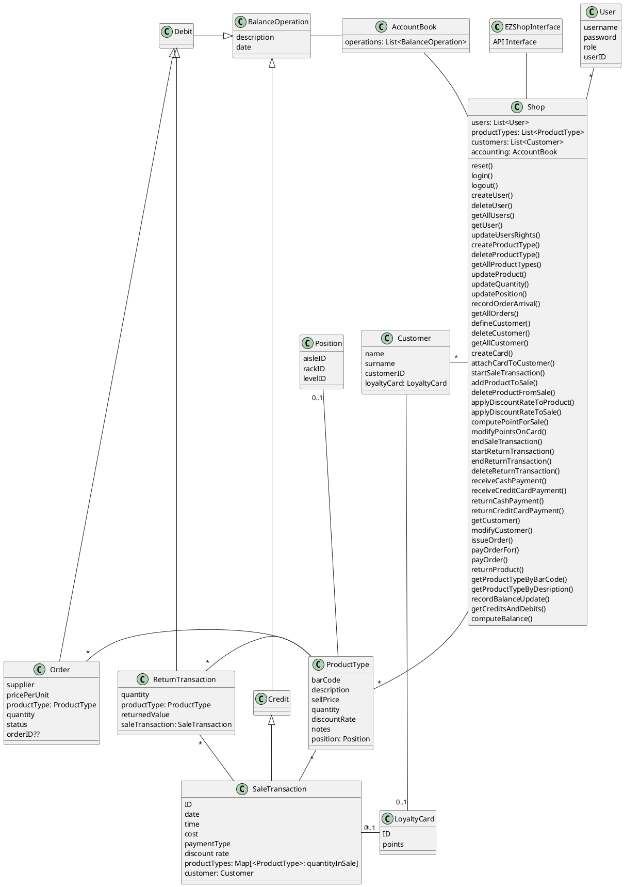

- servono 3 package: data, model, exceptions
- ci daranno la classe Customer, User, ProductType e le Exceptions perche' ci sono nell'API (non serve metterle nel nostro class diagram perche' tanto non sappiamo come sono fatte)
- volendo si possono aggiungere altre exception al package Exception
- sequence diagrams nomi funzioni
- Sequence diagrams anche solo per gli scenari piu' importanti, l'importante e' avere tutte le classi che servono
- differenza tra ticket e saleTransaction e' che si puo' fare rollback della transazione ma non del ticket, decidiamo noi se avere una classe apposta per il ticket o meno
- scrivere tipo di collezioni usate
- nota vicino alle classi persistenti, non e' necessario mostrare le interazioni con lo storage
- Shop implements API interface
- No implementazione delle relationship, solo frecce e indicare collection usata 
- Nel sequence diagram basta function name senza parametri\
- Issue: ID of customer integer o string?
- Per gestire file di credit card per ora basta una classe credit card
- estimation approach non scrivere niente
- position refers to the product type. in practice EZShop does not manage products
- sequence diagram should contain only the steps, not pre and post conditions
- API interface covers many aspects, both data and logic
- Gantt chart time? relative better, if you have a tool then it trasforms it automatically on absolute. in fact tools do also the opposite, so it does not matter much
- createProductType computes an ID and returns it - this is not the barcode
- We noticed that in addProductToSale is possible that the quantity of the product inserted can be less than the availability in our inventory, but this situation could not be possible in real life because if we take n physical product they will be in the inventory for sure. -> 1 may be, but keep it like it is now
- In the cash Payment method the cashier does not know the total amount of the sale. Should there be a method that returns the total amount when the transaction is closed ? no, compute and keep the total amount somewhere
- In the scenarios related to the SaleTransaction there is the step "Confirm the sale and prints the sale Ticket" but there's no method to confirm a sale and authorize the print of a ticket. you have endSaleTransaction - the print is skipped since there is no printer
- there's not a method to add a loyalty card (or a customer) to the sale transaction. Moreover, when a transaction ends, it is not specified to update the customer's points. So, the points are never updated on the card. Is it a mistake or are we missing something? this is done at GUI level, where the loyalty card number is entered, then computePointsForSale() and modifyPointsOnCard() are called
- in design Product is not needed
-  NFR4, by either 12 13 or 14 digits you mean that it should be able to manage all these three cases
- usually you have a User class that is persistent and contains the link to the db - showing the User class is enough (with a note to show that it is persistent)
- the balance changes all the time. each time there is a transaction
- the cashier enters the bar code on the GUI. Device drivers would be needed in a real EZSHop, but here no since no hw is actually used
- in the sequence you can have actors
- yes - the sequence is 'similar' to a trace from a debugger, but it does need to be at this level of detail  - so skip really low level calls (like getters etc)
- 
class Shop{
    public boolean updateQuantity(Integer productId, int toBeAdded){
        Product p=getProductbyID(productId)
        p.setQuantity(p.getQuantity+toBeAdded);
    }
}

class ProductType{
    public int getQuantity(void){
        return this.quantity;
    }
    public void setQuantity(int quantity){
        this.quantity=quantity;
    }
}

controllare se dobbiamo aggiungere metodi nelle nostre classi per fare funzionare login() e logout() & payOrderFor()
Aggiungere push(ProductType) a addProductToSale()?? e deleteProductFromSale()??
applyDiscountRateToProduct()??
update per points con computePointsForSale()?

